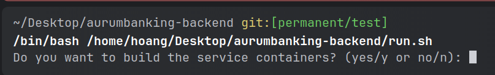
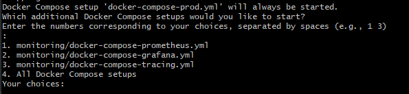
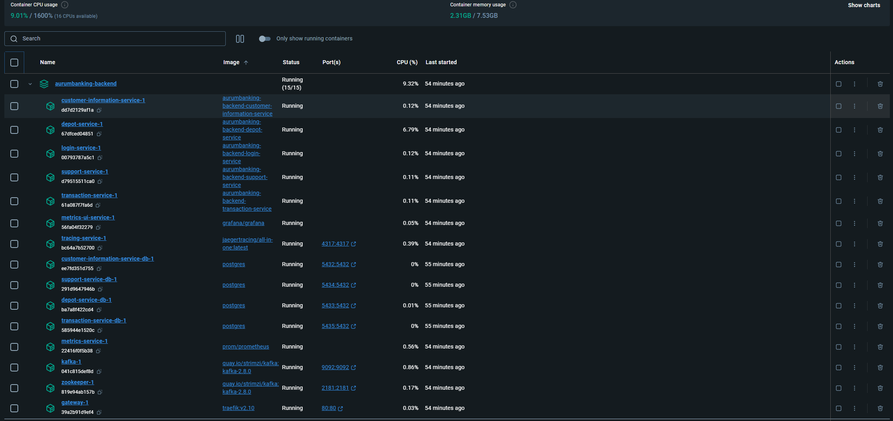
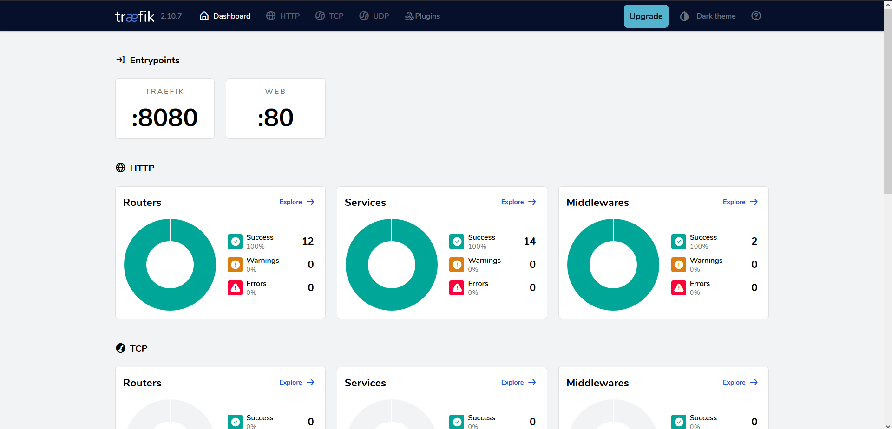

<div id="top"></div>

<br />
<div align="center">
  <a href="https://git.ai.fh-erfurt.de/ai/sose-2024/cloud-computing/team-04-aurumbanking/aurumbanking-backend">
    
  </a>
  <br>
  <h1 align="center"> Cloud Computing- AurumBanking-Backend</h1>

</div>


Backend for the AurumBanking-Banking App.

**_For the detailed documentation, please following the steps._**

## Run mdkocs locally
1. run on on root path of this project:
   - linux, mac: `sh assemble-docs.sh`
   - windows: `./assemble-docs.sh`
2. `python -m pip install mkdocs`
3. `python -m pip install mkdocs-material`
4. `python -m mkdocs serve --dev-addr 127.0.0.1:4242`

## How to run stuff

<details>
<summary>Run Backend on PROD </summary>

- start in the root dir of this project
- run this shell scrip:
  - linix/mac: `sh run.sh`
  - windows: `./run.sh`
- press y/yes to build the entire project:



- after build finish, press number 5 to run all docker-compose files:



- now we can see the services running 



- go to browser: `http://localhost/dashboard/`
- insert this credetials:
  - `user`
  - `123`

- here is the dashboard on prod:




<p align="right">(<a href="#top">back to top</a>)</p>
</details>


<details>
<summary>DEV-UI</summary>

- `http://localhost:8080/q/dev-ui/io.quarkus.quarkus-smallrye-openapi/swagger-ui`
- `http://localhost:8080/q/dev-ui/io.quarkus.quarkus-kafka-client/topics`
- `http://localhost:8080/dashboard/#/`

<p align="right">(<a href="#top">back to top</a>)</p>
</details>

<details>
<summary>Quarkus-UI in PROD</summary>

- http://localhost/dashboard/#/

<p align="right">(<a href="#top">back to top</a>)</p>
</details>

<details>
<summary>Prometheus & Grafana in PROD</summary>

- Traefk-Dashboard: http://localhost/dashboard/
- Prometheus: http://localhost/prometheus
- Grafana: http://localhost/metrics-ui-service/login
- Jaeger-Tracing: http://localhost/tracing/search

<p align="right">(<a href="#top">back to top</a>)</p>
</details>

<details>
<summary>run mkdocs locally</summary>

- `python -m pip install mkdocs`
- `python -m pip install mkdocs-material`
- `python -m mkdocs serve --dev-addr 127.0.0.1:4242`

<p align="right">(<a href="#top">back to top</a>)</p>
</details>


## Pipeline
<details>
<summary>Setup-Pipeline</summary>

<p><strong>_token:_</strong></p>
<ul>
  <li>linux: <strong>_glrt-xznuGhoqctjSmbVNxpm_</strong></li>
  <li>windows-hoang: <strong>_glrt-xznuGhoqctjSmbVNxpm_</strong> / <strong>_glrt-aHawSL4WALWi1s6BXdVi_</strong></li>
  <li>steffan-gitlab-runner: <strong>_glrt-Fzfyj9euFsuo1f_szyUo_</strong></li>
  <li>milena-gitlab-runner: <strong>_glrt-pzYxkWTn55mxxy4S4hXA_</strong></li>
  <li>salma-gitlab-runner: <strong>_glrt-sQu4HSKd7RgotJkPHwCn_</strong></li>
</ul>


```bash
docker run --rm -it -v gitlab-runner-config:/etc/gitlab-runner gitlab/gitlab-runner:latest register .\gitlab-runner.exe register --url https://git.ai.fh-erfurt.de --token [$token einfügen]
```
<ul>
  <li>
    Enter the GitLab instance URL (for example, https://gitlab.com/): 
    <strong>[https://git.ai.fh-erfurt.de]: [Enter]</strong>
  </li>
  <li>
    Enter a name for the runner. This is stored only in the local config.toml file: 
    <strong>aurumbanking-gitlab-runner</strong>
  </li>
  <li>
    Enter an executor: parallels, virtualbox, docker, docker-autoscaler, instance, custom, shell, ssh, docker-windows, docker+machine, kubernetes: 
    <strong>docker</strong>
  </li>
  <li>
    Enter the default Docker image (for example, ruby:2.7): 
    <strong>jdk:17</strong>
  </li>
</ul>


```bash
docker run -d --name gitlab-runner --restart always -v /var/run/docker.sock:/var/run/docker.sock -v gitlab-runner-config:/etc/gitlab-runner gitlab/gitlab-runner:latest
```

```bash
docker exec -it gitlab-runner /bin/bash
```

<ul>
  <li>apt update</li>
  <li>apt install nano</li>
  <li>nano /etc/gitlab-runner/config.toml --> set: privileged = true</li>
</ul>

<p align="right">(<a href="#top">back to top</a>)</p>
</details>
<details>
<summary>Pipeline Running Rules</summary>

### Pipeline Running Rules

**_Set the branch name like the following rules, so only certain service related part 
of the entire pipeline will be executed._**

<details>
<summary>Customer Information Service</summary>

- **Prepare Build Cache**
  - Runs for branches matching: `feature/customer-information-service`
  - Also runs for the branch: `test/permant` and `main`

- **Build**
  - Runs for branches matching: `feature/customer-information-service`
  - Also runs for the branch: `test/permant` and `main`

- **Build Image**
  - Runs for branches matching: `feature/customer-information-service`
  - Also runs for the branch: `test/permant` and `main`

<p align="right">(<a href="#top">back to top</a>)</p>
</details>

<details>
<summary>Depot Service</summary>

- **Prepare Build Cache**
  - Runs for branches matching: `feature/depot-service`
  - Also runs for the branch: `test/permant` and `main`

- **Build**
  - Runs for branches matching: `feature/depot-service`
  - Also runs for the branch: `test/permant` and `main`

- **Build Image**
  - Runs for branches matching: `feature/depot-service`
  - Also runs for the branch: `test/permant` and `main`

<p align="right">(<a href="#top">back to top</a>)</p>
</details>

<details>
<summary>Login Service</summary>

- **Prepare Build Cache**
  - Runs for branches matching: `feature/login-service`
  - Also runs for the branch: `test/permant` and `main`

- **Build**
  - Runs for branches matching: `feature/login-service`
  - Also runs for the branch: `test/permant` and `main`

- **Build Image**
  - Runs for branches matching: `feature/login-service`
  - Also runs for the branch: `test/permant` and `main`

<p align="right">(<a href="#top">back to top</a>)</p>
</details>


<details>
<summary>Support Service</summary>

- **Prepare Build Cache**
  - Runs for branches matching: `feature/support-service`
  - Also runs for the branch: `test/permant` and `main`

- **Build**
  - Runs for branches matching: `feature/support-service`
  - Also runs for the branch: `test/permant` and `main`

- **Build Image**
  - Runs for branches matching: `feature/support-service`
  - Also runs for the branch: `test/permant` and `main`

<p align="right">(<a href="#top">back to top</a>)</p>
</details>

<details>
<summary>Transaction Service</summary>

- **Prepare Build Cache**
  - Runs for branches matching: `feature/transaction-service`
  - Also runs for the branch: `test/permant` and `main`

- **Build**
  - Runs for branches matching: `feature/transaction-service`
  - Also runs for the branch: `test/permant` and `main`

- **Build Image**
  - Runs for branches matching: `feature/transaction-service`
  - Also runs for the branch: `test/permant` and `main`

<p align="right">(<a href="#top">back to top</a>)</p>
</details>


<details>
<summary>Documentation</summary>

- **Prepare Documentation Pages**
    - Runs for branches matching: `docs/`
    - Also runs for the branch: `test/permant` and `main`

- **Build Documentation Pages**
    - Runs for branches matching: `docs/`
    - Also runs for the branch: `test/permant` and `main`

<p align="right">(<a href="#top">back to top</a>)</p>
</details>

<p align="right">(<a href="#top">back to top</a>)</p>
</details>
