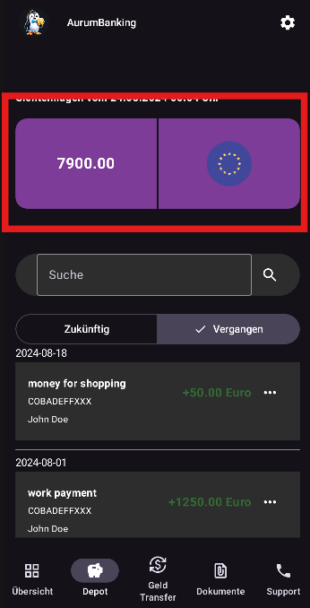
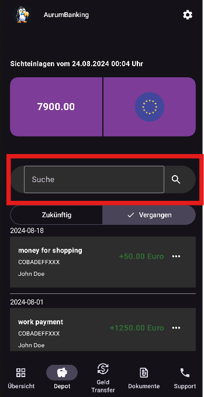
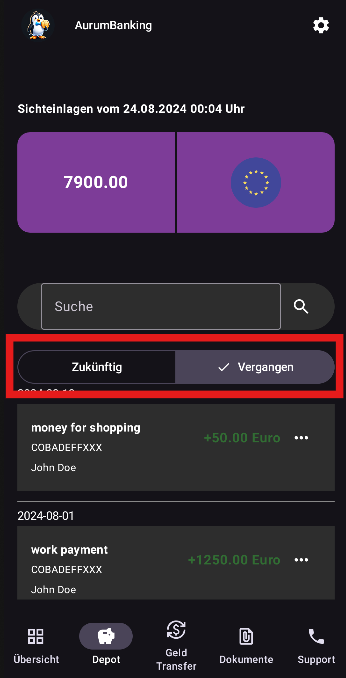
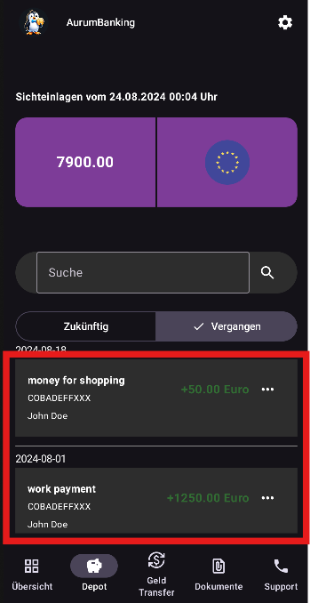
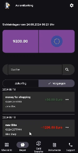
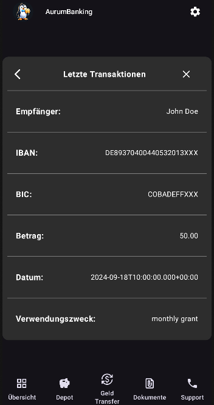

# App Frontend

## Login Screen

 Login Screen 

    <figure style="margin: 0 20px; text-align: center;">
        
        <figcaption>Screenshot of login screen</figcaption>
    </figure>

    <figure style="margin: 0 20px; text-align: center;">
        
        <figcaption>Screenshot of failed login</figcaption>
    </figure>

The <strong>Login Screen </strong> in the <strong> AurumBanking-App </strong> provides users with a simple interface to enter their email and password for authentication.

<h3> Screen Elements </h3>

<ul>
    <li><strong>Penguin Mascot</strong>: A friendly penguin mascot is displayed prominently at the top of the screen, providing a welcoming visual.</li>
    <li><strong>Email Field</strong>: A text input field where the user can enter their email address.</li>
    <li><strong>Password Field</strong>: A password input field where the user can enter their account password. The password is masked for security.</li>
    <li><strong>Login Button</strong>: A button labeled "Login" that submits the email and password for authentication.</li>
</ul>

<h3> Behavior </h3>

<ul>
    <li><strong>Successful Login</strong>: If the user enters the correct email and password, they are authenticated and redirected to the app's main screen.</li>
    <li><strong>Failed Login</strong>: If the user enters incorrect login credentials, a small error message is displayed at the bottom of the screen, informing the user that their credentials are incorrect. The message helps guide the user to try again with the correct information.</li>
</ul>

<h3> Error Handling </h3>

<ul>
    <li><strong>Incorrect Credentials</strong>: When the login attempt fails due to incorrect email or password, a small, clear error message is shown to the user below the login fields, helping them understand the issue and try again.</li>
</ul>

## Overview-Screen

 Overview-Screen 

 In the following GIF, you can see the functional elements of the Overview Screen. It consists of the app scaffold with some shortcut icons below, which allow the user to quickly access certain pages. 

<figure>
    
    <figcaption>Overview-Screen in Dark-Mode</figcaption>
</figure>

 Below that is the Depot segment, which displays the current depot value. This value is fetched and updated every 3 seconds. 

 Next are the recent transactions that the user has either received or executed. The three most recent transactions are shown. 

 Finally, there is the Chart Segment, which accumulates all transactions for a given day and displays them as a bar chart. 
It shows the current day, 2 days in the past, and 2 days in the future, as there may already be transactions scheduled for those days. 
Transactions for the current day are always displayed in the center. 

 When you tap approximately in the middle of the chart, a red marker appears to indicate that it is the current day. 

 In the following, you can see the Overview Screen in White Mode. 

<figure>
    
    <figcaption>Overview-Screen in White-Mode</figcaption>
</figure>

<figure>
    
    <figcaption>Overview-Screen in White-Mode</figcaption>
</figure>

## Depot-Screen

 Depot-Screen 

<figure>
    
    <figcaption>Screenshot of Depot Screen</figcaption>
</figure>

  The Depot Screen is desinged to give a basic overview over all relevant depot activities (transactions) and key figures. It
  also allows a search function across all transactions and can switch between displaying transactions from the past and
  planned transactions in the future

<h3>Key Elements:</h3>

<ul>
    <li>Depot Overview Box: Depot Value highlighted on top of the screen</li>
    <li>Search Box: Element to filter transactions</li>
    <li>Time Choice Button: Element to switch transactions from past and for future</li>
    <li>Transaction List: All Transactions that match the chosen attributes</li>
</ul>

<h3>Depot Overview Box:</h3>

<figure>
    
    <figcaption>Screenshot of Depot Screen with depot overview Box</figcaption>
</figure>

  The Depot Overview Box is the same element as the once used at the **Overview Screen**. It is used to display the current
  Deposit Value and the uses currency area.

<h3>Search Box</h3>

<figure>
    
    <figcaption>Screenshot of Search Box Element at Depot Screen</figcaption>
</figure>

  The Search Box Element allows a selection of the displayed transactions for a given text value. It will than filter the
  transaction list for transactions, that contain the given text in the recipient-attribute.

<h3>Time Choice Button:</h3>

<figure>
    
    <figcaption>Screenshot of Time Choice Button</figcaption>
</figure>

  With the Time Choice Button Element, the user can switch between displaying transactions from the past or future.
  By default, the button is set to "Vergangen" and will diplay past transactions. The text in the Search Box acts in addition
  to this. So the transaction list will only display transactions in the chosen time frame with the given search text.

<h3>Transaction List:</h3>

<figure>
    
    <figcaption>Screenshot of Trnasaction List</figcaption>
</figure>

  The Transaction List displays all transactions, that fit in the given parameters out of Search Box and Time Choice Button.
  It is managed via a LazyColumn and sorted descending via the initial transaction date (dateTimeOfFirstExecutionLocalDate).
  The list elements are also TransactionCard-elements such as used on the **Overview Screen**. Cash receipts will be
  displayed green, cash outflows red.  By clicking at the  3-point-button at the element, the user switches to the
  TransactionDetailScreen as subview of the DepotScreen.

<ul>
    <li>Error Message: Keine Daten vorhanden: — indicates that the loading process was not able to find transactions for
      the current depot or there have been no transactions for the depot until now</li>
</ul>

<h3>Transaction Detail Screen:</h3>

<figure>
    
    <figcaption>Screenshot of Trnasaction List</figcaption>
</figure>

  The TransactionDetailScreen gives the user a more detailed view of a specific transaction. It also displayed the detailed
  Bank connection (IBAN and BIC) and the detailed date and time of the transaction.

## Transaction-Screen

## Support-Screen

Support Screen 

<h3> Support Option View </h3>

<figure>
    
    <figcaption>Screenshot of the main support view</figcaption>
</figure>

<h3> Support Option View </h3>

 The <strong>Support Option View</strong> in the AurumBanking app is designed to provide users with various options to resolve any issues or answer questions quickly and efficiently. 

<h4> Options: </h4>

<ol>
    <li><strong>Support Inquiry</strong>:  
        Tap the mail icon to send a direct support request.
    </li>
    <li><strong>Phone Support</strong>:  
        Users can choose to contact customer support by phone. Tapping opens the integrated telephone app on the used mobile device. The number is automatically inserted.
    </li>
    <li><strong>FAQ Section</strong>:  
        The information icon leads users to the frequently asked questions (FAQ) section.
    </li>
</ol>

<h3> Support Request View </h3>

    <figure style="margin: 10px;">
        
        <figcaption>Screenshot of the support request screen</figcaption>
    </figure>

    <figure style="margin: 10px;">
        
        <figcaption>Screenshot of the error message</figcaption>
    </figure>

    <figure style="margin: 10px;">
        
        <figcaption>Screenshot of the success message</figcaption>
    </figure>

<h4> Support Request Screen </h4>

 This screen allows users to submit a support request by filling out the necessary information. The user can enter their legal name, the type of inquiry, their email address, and a message detailing their issue. 

<ul>
    <li><strong>Legal Name</strong>: The user's legal name, which is provided from the session manager.</li>
    <li><strong>Type of Inquiry</strong>: Users can choose from a dropdown-menu (e.g., Überweisung, Konto, Benutzerdaten).</li>
    <li><strong>Email Address</strong>: The user's contact email address, which also is provided.</li>
    <li><strong>Message</strong>: A text field where the user can enter their specific issue or question.</li>
</ul>

 At the bottom, there is a <strong>Send</strong> button that the user can tap to submit the support request. When the button is clicked, the user inputs get checked. For example the message field must be filled and the type must be selected.
At the top is a small menu bar with a check icon with the same functionality as the "senden" button 
 

<h4> Support Request Submitted (Success) Screen </h4>

 Once the user successfully submits their support request, a confirmation popup appears to inform them that their request has been received. This dialog reassures the user that their inquiry is being processed. 

<ul>
    <li><strong>Confirmation Message</strong>: "Anfrage gesendet" — informs the user that the support request has been sent.</li>
    <li><strong>Details</strong>: The message also states that the request will be processed as quickly as possible.</li>
</ul>

 The user can tap <strong>OK</strong> to dismiss the popup and return to the app. 
>

<h4> Support Request Error (Failure) Screen </h4>

If there are any issues with the support request submission (e.g., missing required fields), the user is shown an error popup. This message prompts the user to complete the missing information.

<ul>
    <li><strong>Error Message</strong>: "Fehler" — indicates that an error occurred during the submission process.</li>
    <li><strong>Details</strong>: The message encourages the user to "Bitte füllen Sie alle Felder korrekt aus." (Please fill out all fields correctly).</li>
    <li><strong>Sending Error</strong>: If there is an error from sending, there is a different error message to inform the user.</li>
</ul>

The user can tap <strong>OK</strong> to dismiss the error and return to the form to correct the mistakes.

<h3> Support Sub Screens </h3>

    <figure style="margin: 10px;">
        
        <figcaption>Screenshot of the FAQ screen</figcaption>
    </figure>

    <figure style="margin: 10px;">
        
        <figcaption>Screenshot of the telephone support</figcaption>
    </figure>

    <figure style="margin: 10px;">
        
        <figcaption>Screenshot of telephone app screen</figcaption>
    </figure>

<h4> FAQ Screen </h4>

 This screen provides users with a Frequently Asked Questions (FAQ) section, helping them resolve common issues and inquiries. Users can expand the questions to read answers about setting up their account, the security of the app, and how to transfer money to another account. 

<strong> Key Elements: </strong>

<ul>
    <li><strong>FAQ Cards</strong>: The screen displays collapsible cards for each FAQ topic.</li>
    <li><strong>Questions Addressed</strong>:
        <ul>
            <li>Setting up a new account in the app.</li>
            <li>Security measures to protect the account.</li>
            <li>Transferring money to another account.</li>
        </ul>
    </li>
</ul>

<h4> Telephone Support Screen </h4>

 This screen allows users to access AurumBanking's telephone support. The app provides the contact information, including the phone number and business hours (Monday to Friday, 8:00 - 20:00), enabling users to get direct support from customer service.

<ul>
    <li><strong>Key Elements</strong>:</li>
    <ul>
        <li><strong>Phone Number Display</strong>: The contact number for customer service.</li>
        <li><strong>Support Hours</strong>: Operating hours are clearly displayed for user reference.</li>
    </ul>
</ul>

<h4> Telephone App Screen </h4>

 This screen shows the user's telephone dialer with the AurumBanking support number pre-filled. From this screen, the user can directly call the support line, create a new contact, add the number to an existing contact, or send an SMS. 

<ul>
    <li><strong>Key Elements</strong>:</li>
    <ul>
        <li><strong>Dial Pad</strong>: The dialer pad with the pre-filled AurumBanking support number.</li>
        <li><strong>Options Menu</strong>: Additional options to create a new contact, add to an existing contact, or send an SMS.</li>
    </ul>
</ul>

<h3> Screens in White Mode </h3>

     <figure style="margin: 10px;">
        
        <figcaption>Screenshot the support main view in whitemode</figcaption>
    </figure>

    <figure style="margin: 10px;">
        
        <figcaption>Screenshot of the support request screen in whitemode</figcaption>
    </figure>   

    <figure style="margin: 10px;">
        
        <figcaption>Screenshot of the telephone support in whitemode</figcaption>
    </figure>

## Settings Screen 

 Settings Screen 

<h3> Settings Option Screen in AurumBanking App </h3>

<figure style="margin-right: 20px;">
    
    <figcaption>Screenshot of the settings option screen</figcaption>
</figure>

<figure>
    
    <figcaption>Screenshot of the settings option screen in white mode</figcaption>
</figure>

    The <strong>Settings Option Screen</strong> in the <strong>AurumBanking</strong> app serves as the main hub for users to manage their personal settings. From this screen, the user can access various important functions related to their account and the app's appearance.

<h4> Overview of the Settings Option Screen </h4>

 Upon accessing the settings screen, the user is greeted by the app's mascot and a friendly prompt: **"Hier können Sie Einstellungen vornehmen!"**, which translates to "Here you can make settings!" in English. Below this prompt, the user is presented with three main options:

<ul>
    <li><strong>Personal Data (Persönliche Daten)</strong>: Allows the user to view and edit their personal information, such as their name, address, and contact details.</li>
    <li><strong>Change Password (Passwort ändern)</strong>: Provides a secure method for the user to change their account password.</li>
    <li><strong>Change Design (Design ändern)</strong>: Enables the user to switch between different design modes (e.g., light and dark mode) for the app's appearance.</li>
</ul>

<h4> Additional Notes </h4>

<ul>
    <li>This screen acts as a central location for managing account settings and appearance options within the app.</li>
    <li>The user can quickly access this screen by tapping the gear icon located in the top right corner of the main screen.</li>
</ul>

<h3> Change To Whitemode Screen </h3>

<figure>
    
    <figcaption>gif of changing to whitemode</figcaption>
</figure>

The <strong>AurumBanking</strong> app provides a setting option to change the visual design of the app. This allows the user to switch between different themes, such as a light or dark mode, depending on their preference.

<h4>Overview of the White Mode Setting</h4>

The white mode (or light mode) setting is accessible from the <strong>Settings</strong> screen within the AurumBanking app. Upon selecting this option, the user interface of the app transitions to a lighter color palette, making it easier to view in well-lit environments.

By selecting the <strong>Möchten Sie auf White-Mode/Dark-Mode wechseln</strong> option, the user can alter the appearance of the app. The app will ask for confirmation, and after clicking <strong>"verstanden"</strong>, the app will switch to the desired mode.

<h3> Change Password Screen in AurumBanking App </h3>

    

    
    <figure style="margin-right: 20px;">
        
        <figcaption>Screenshot of the new password screen</figcaption>
    </figure>
    
    <figure>
        
        <figcaption>Screenshot of the new password screen in white mode</figcaption>
    </figure>
    
    

<h4> Change Password Screen in AurumBanking App </h4>

The <strong>Change Password Screen</strong> in the <strong>AurumBanking</strong> app allows users to securely update their account password. This screen provides an intuitive and user-friendly interface for changing the password in three simple steps.

<h4> Overview of the Change Password Screen </h4>

Upon accessing this screen, the user is prompted with the message <strong>"Hier können Sie ihr Passwort ändern!"</strong>, which translates to "Here you can change your password!" in English.

The user is presented with three fields:

<ul>
    <li><strong>Old Password (Altes Passwort)</strong>: The user enters their current password.</li>
    <li><strong>New Password (Neues Passwort)</strong>: The user enters a new password they would like to set.</li>
    <li><strong>Repeat New Password (Neues Passwort wiederholen)</strong>: The user repeats the new password for confirmation.</li>
</ul>

At the bottom, the user can tap the <strong>"Bestätigen"</strong> (Confirm) button to complete the password change process.

<h4> Additional Notes </h4>

<ul>
    <li>The change password process is designed to ensure security, requiring the user to input their old password before confirming the new one.</li>
    <li>This screen can be accessed from the <strong>Settings</strong> menu by selecting the <strong>Change Password</strong> option.</li>
</ul>

<h3> Personal Data Screen in AurumBanking App </h3>

    

    
    <figure style="margin-right: 20px;">
        
        <figcaption>Screenshot of settings personal data</figcaption>
    </figure>
    
    <figure>
        
        <figcaption>Screenshot of settings personal data in whitemode</figcaption>
    </figure>
    
    

The <strong>Personal Data Screen</strong> in the <strong>AurumBanking</strong> app allows the user to view their account information in a detailed and structured format. This screen provides essential details about the user's account, such as their legal name, address, contact information, and account number.

<h4> Overview of the Personal Data Screen </h4>

On this screen, the user can see their information displayed clearly under the following categories:

<ul>
    <li><strong>Profile Picture</strong>: Profile Picture of the user.</li>
    <li><strong>Legal Name</strong>: The full legal name of the account holder.</li>
    <li><strong>Address</strong>: The account holder's address, including street, postal code, city, and country.</li>
    <li><strong>Phone Number</strong>: The user's contact phone number.</li>
    <li><strong>Email Address</strong>: The registered email associated with the user's account.</li>
    <li><strong>Account Number</strong>: The unique account number assigned to the user.</li>
</ul>

<h4> Additional Notes </h4>

<ul>
    <li>The user can access this screen by navigating through the <strong>Settings</strong> menu and selecting the <strong>Personal Data</strong> option.</li>
    <li>All the data shown here is private and secure, ensuring that only the account holder has access to their personal details.</li>
</ul>

