# App Frontend

## Login Screen

 Login Screen 

    <figure style="margin: 0 20px; text-align: center;">
        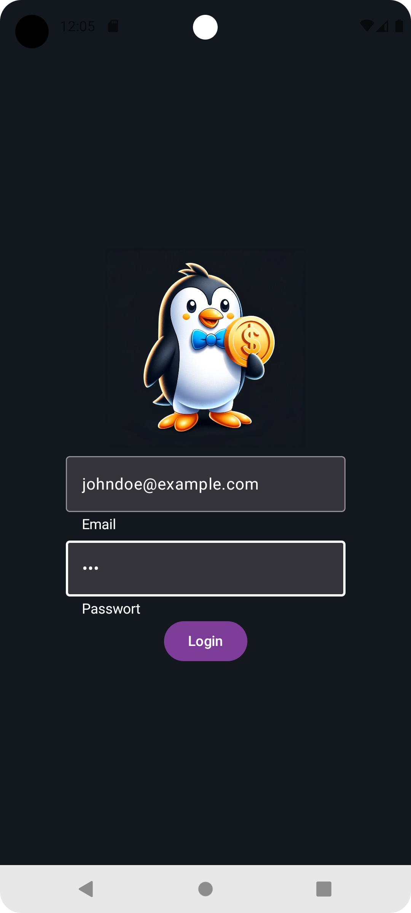
        <figcaption>Screenshot of login screen</figcaption>
    </figure>

    <figure style="margin: 0 20px; text-align: center;">
        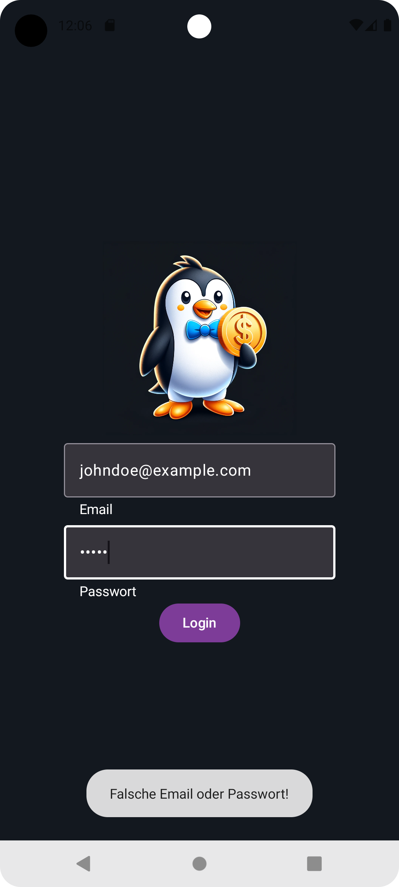
        <figcaption>Screenshot of failed login</figcaption>
    </figure>

The <strong>Login Screen </strong> in the <strong> AurumBanking-App </strong> provides users with a simple interface to enter their email and password for authentication.

<h3> Screen Elements </h3>

<ul>
    <li><strong>Penguin Mascot</strong>: A friendly penguin mascot is displayed prominently at the top of the screen, providing a welcoming visual.</li>
    <li><strong>Email Field</strong>: A text input field where the user can enter their email address.</li>
    <li><strong>Password Field</strong>: A password input field where the user can enter their account password. The password is masked for security.</li>
    <li><strong>Login Button</strong>: A button labeled "Login" that submits the email and password for authentication.</li>
</ul>

<h3> Behavior </h3>

<ul>
    <li><strong>Successful Login</strong>: If the user enters the correct email and password, they are authenticated and redirected to the app's main screen.</li>
    <li><strong>Failed Login</strong>: If the user enters incorrect login credentials, a small error message is displayed at the bottom of the screen, informing the user that their credentials are incorrect. The message helps guide the user to try again with the correct information.</li>
</ul>

<h3> Error Handling </h3>

<ul>
    <li><strong>Incorrect Credentials</strong>: When the login attempt fails due to incorrect email or password, a small, clear error message is shown to the user below the login fields, helping them understand the issue and try again.</li>
</ul>

## Overview-Screen

 Overview-Screen 

<h3> Overview-Screen </h3>

 In the following GIF, you can see the functional elements of the Overview Screen. It consists of the app scaffold with some shortcut icons below, which allow the user to quickly access certain pages. 

<figure>
    
    <figcaption>Overview-Screen in Dark-Mode</figcaption>
</figure>

<figure>
    
    <figcaption>Using the shortcut</figcaption>
</figure>

 Below that is the Depot segment, which displays the current depot value. This value is fetched and updated every 3 seconds. 

 Next are the recent transactions that the user has either received or executed. The three most recent transactions are shown. 

 Finally, there is the Chart Segment, which accumulates all transactions for a given day and displays them as a bar chart. 
It shows the current day, 2 days in the past, and 2 days in the future, as there may already be transactions scheduled for those days. 
Transactions for the current day are always displayed in the center. 

 When you tap approximately in the middle of the chart, a red marker appears to indicate that it is the current day. 

 In the following, you can see the Overview Screen in White Mode. 

<figure>
    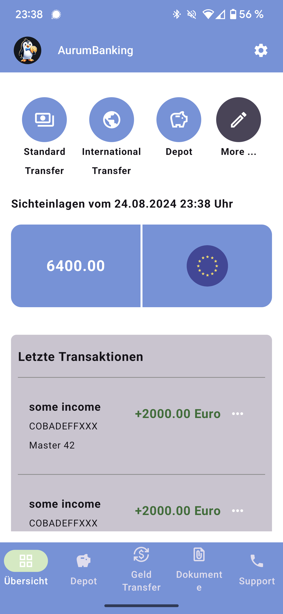
    <figcaption>Overview-Screen in White-Mode</figcaption>
</figure>

<figure>
    
    <figcaption>Overview-Screen in White-Mode</figcaption>
</figure>

<h3> Backend-Connection </h3>

The <strong>Overview-Screen</strong> use the code in 
<code>OverviewViewModel</code> to connect to the backend services. 
Here's a summary of what the methods do and how they interact with the backend:

    <h4>Methods</h4>
    <ul>
        <li>
            <strong>getCurrentDepotValue</strong>: 
            
Retrieves the current depot value for a given customer ID by making an API call through <code>DepotService</code>. The response is handled asynchronously. If successful, it returns the depot value to the UI; otherwise, it logs an error. This function is used by the Depot-Display section.

        </li>
        <li>
            <strong>getThreeLatestTransaction</strong>:
            
Fetches the three most recent transactions for a specified depot ID using <code>TransactionService</code>. The method asynchronously processes the response, returning the transactions to the UI or logging an error if the request fails. This is used by the section <strong>Letzte Transaktionen</strong> in the Overview-Screen.

        </li>
        <li>
            <strong>getAllTransactionByDepotId</strong>:
            
Retrieves all transactions for a given depot ID. It then filters these transactions to include only those within the last three days and the next three days. After filtering, it calculates daily totals from these transactions and sends the data back to the UI. This method utilizes <code>getThreeLastDaysAndFutureDays</code> to filter the transactions and <code>calculateDailyTotals</code> to compute the totals used in diagrams.

        </li>
        <li>
            <strong>calculateDailyTotals</strong>:
            
Takes a list of transactions and groups them by date. For each date, it calculates the net total by adding or subtracting amounts based on the transaction type (income or outcome). It is used for generating the data needed for diagrams.

        </li>
        <li>
            <strong>getThreeLastDaysAndFutureDays</strong>:
            
Filters transactions to include only those that occurred within the last three days and the next three days from the current date. This filtered list is then used in <code>getAllTransactionByDepotId</code>.

        </li>
    </ul>

## Depot-Screen

 Depot-Screen 

<h3> Depot-Screen Overview </h3>

<figure>
    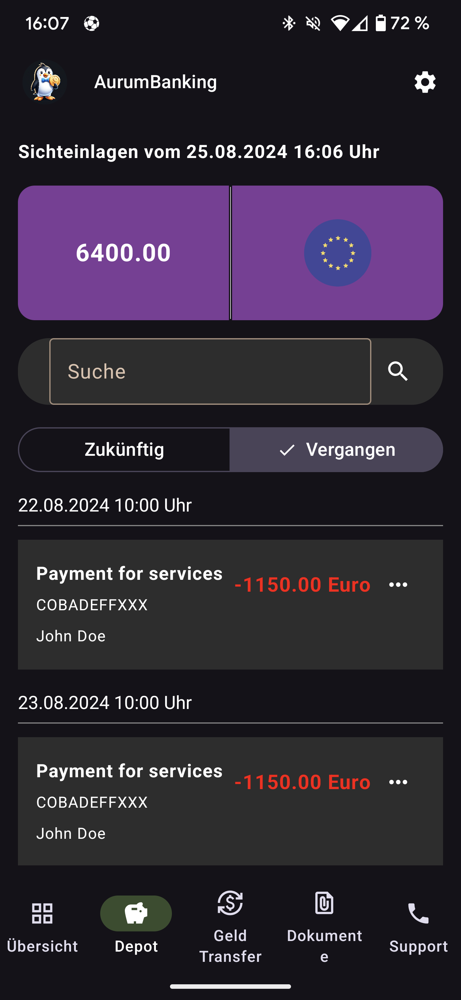
    <figcaption> Depot Screen Darkmode</figcaption>
</figure>

<figure>
    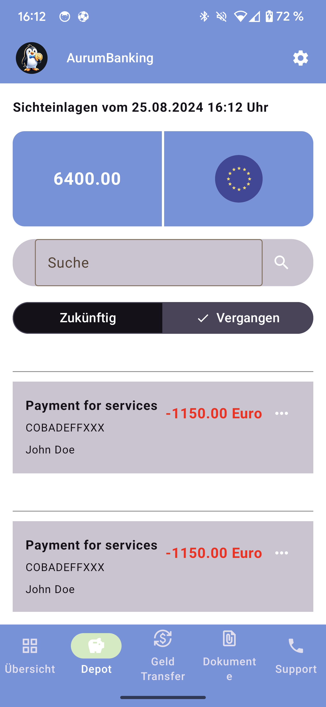
    <figcaption>Depot Screen Whitemode</figcaption>
</figure>

  The Depot Screen is designed to give a basic overview over all relevant depot activities (transactions) and key figures. It
  also allows a search function across all transactions and can switch between displaying transactions from the past and
  planned transactions in the future

<h3>Key Elements:</h3>

<ul>
    <li>Depot Overview Box: Depot Value highlighted on top of the screen</li>
    <li>Search Box: Element to filter transactions</li>
    <li>Time Choice Button: Element to switch transactions from past and for future</li>
    <li>Transaction List: All Transactions that match the chosen attributes</li>
</ul>

<h3>Depot Overview Box:</h3>

<figure>
    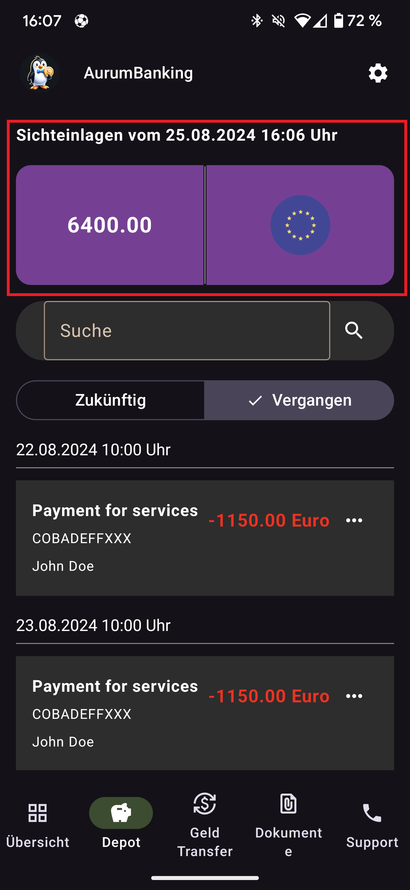
    <figcaption>Screenshot of Depot Screen with depot overview Box</figcaption>
</figure>

  The Depot Overview Box is the same element as the once used at the **Overview Screen**. It is used to display the current
  Deposit Value and the uses currency area.

<h3>Search Box</h3>

<figure>
    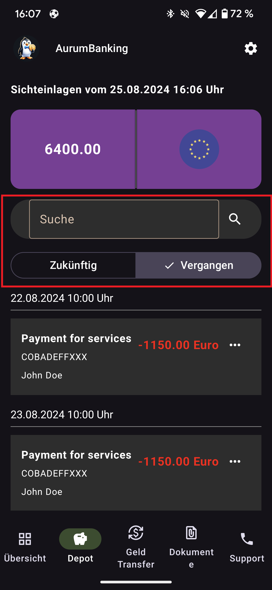
    <figcaption>Screenshot of Search Box Element at Depot Screen</figcaption>
</figure>

  The Search Box Element allows a selection of the displayed transactions for a given text value. It will than filter the
  transaction list for transactions, that contain the given text in the recipient-attribute.

    The user can enter strings in the search field and search either by clicking the <strong>Search</strong> button or by using the <strong>Vergangene</strong> or <strong>Zukünftig</strong> toggle switch.

You can filter by the following elements:

<ul>
  <li><strong>Recipient</strong></li>
  <li><strong>IBAN</strong></li>
  <li><strong>Purpose of Use</strong></li>
  <li><strong>Date and Time of First Execution</strong></li>
  <li><strong>Money Value</strong></li>
</ul>

<figure style="margin: 10px;">
    
    <figcaption> Filtering via switch <strong>Vergangen</strong> </figcaption>
</figure>

<figure style="margin: 10px;">
    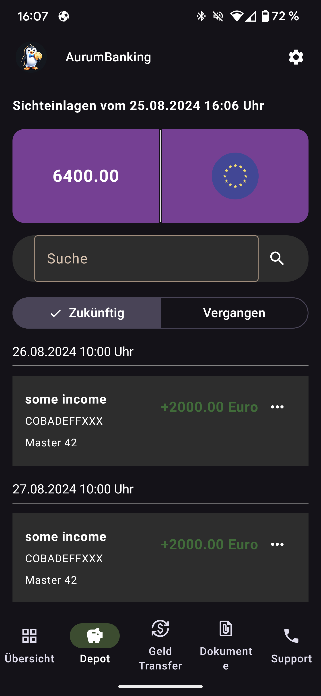
    <figcaption> Filtering via switch <strong>Zukünftig</strong> </figcaption>
</figure>

<figure style="margin: 10px;">
    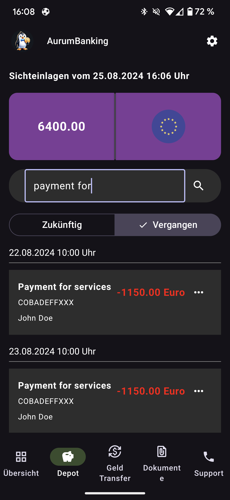
    <figcaption> Filtering via switch Search-String and <strong>Vergangen</strong></figcaption>
</figure>

<figure style="margin: 10px;">
    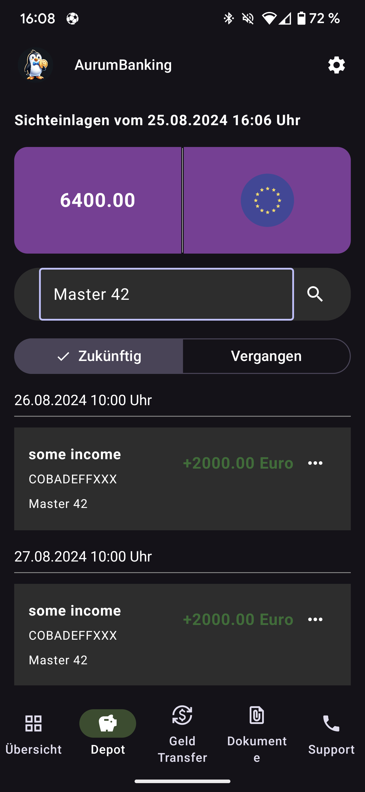
    <figcaption> Filtering via switch Search-String and <strong>Zukünftig</strong> </figcaption>
</figure>

<figure style="margin: 10px;">
    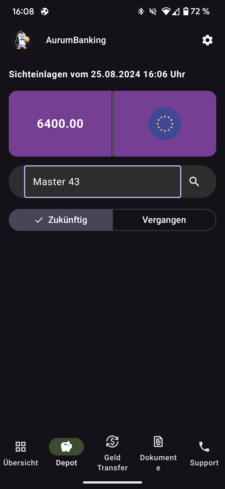
    <figcaption> Filtering via switch Search-String and <strong>Zukünftig</strong> with no matching result </figcaption>
</figure>

<h3>Time Choice Button:</h3>

<figure>
    
    <figcaption>Screenshot of Time Choice Button</figcaption>
</figure>

  With the Time Choice Button Element, the user can switch between displaying transactions from the past or future.
  By default, the button is set to "Vergangen" and will display past transactions. The text in the Search Box acts in addition
  to this. So the transaction list will only display transactions in the chosen time frame with the given search text.

<h3>Transaction List:</h3>

<figure>
    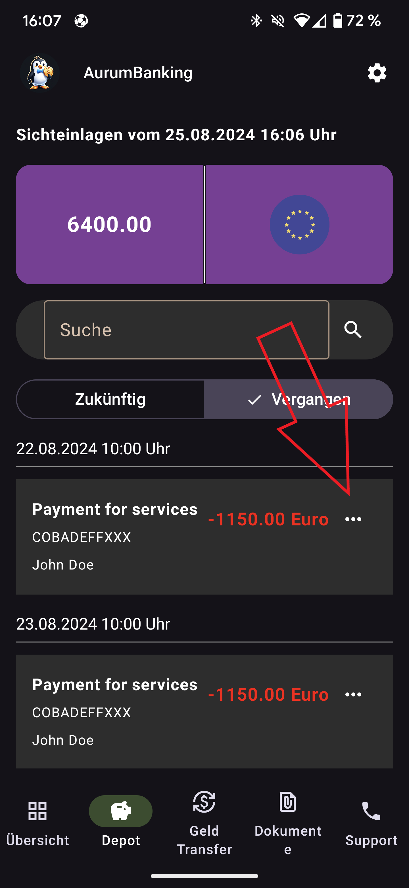
    <figcaption>Screenshot of Transaction List</figcaption>
</figure>

  The Transaction List displays all transactions, that fit in the given parameters out of Search Box and Time Choice Button.
  It is managed via a LazyColumn and sorted descending via the initial transaction date (dateTimeOfFirstExecutionLocalDate).

  The list elements are also TransactionCard-elements such as used on the <strong>Overview Screen</strong>. Cash income will be
  displayed green, cash outflows red. By clicking at the 3-point-button at the element, the user switches to the
  TransactionDetailScreen as subview of the DepotScreen.

<h3>Transaction Detail Screen:</h3>

<figure>
    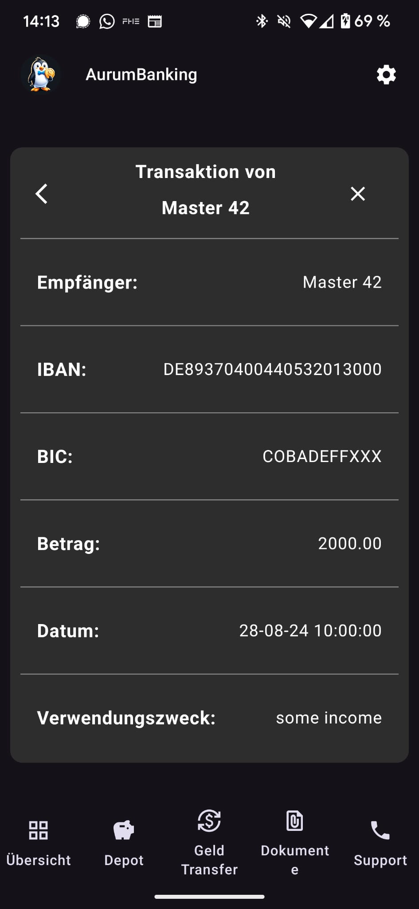
    <figcaption> Transaction-Detail-Screen</figcaption>
</figure>

<figure>
    
    <figcaption> Transaction-Detail-Screen Whitemode </figcaption>
</figure>

  The Transaction-Detail-Screen gives the user a more detailed view of a specific transaction. It also displayed the detailed
  Bank connection (IBAN and BIC) and the detailed date and time of the transaction.

<h3>Backend-Connection</h3>

The <code>DepotViewModel</code> for a Depot-Screen is uses to load data from a server. It has two main functions:

<ul>
    <li>
        
<strong><code>getTransactionById(callback: (TransactionResponse?) -> Unit)</code></strong>:

        <ul>
            <li>Fetches a specific transaction based on the <code>transactionId</code> stored in the <code>SessionManager</code>.</li>
            <li>Performs the network call on a background thread.</li>
            <li>If successful, the result is returned via a callback; otherwise, an error is logged.</li>
        </ul>
    </li>
    <li>
        
<strong><code>getAllTransactionByDepotId(depotId: Long, callback: (List&lt;TransactionResponse&gt;) -> Unit)</code></strong>:

        <ul>
            <li>Retrieves all transactions for a specific depot based on the given <code>depotId</code>.</li>
            <li>The network call is also made asynchronously.</li>
            <li>Results are returned via the callback, or an empty list is returned in case of errors.</li>
        </ul>
    </li>
</ul>

Both methods use <code>Retrofit</code> for network calls and <code>viewModelScope</code> to ensure execution on the correct thread. Errors are logged using <code>Log.e</code>.

## Transaction-Screen

Transaction-Screen

<h3>Overview</h3>

 The <strong>Transaction Overview</strong> screen in the <strong>AurumBanking</strong> app allows users to choose between different types of transactions. The interface is designed for ease of use, allowing users to perform standard, international, or permanent transactions. 

    <figure>
        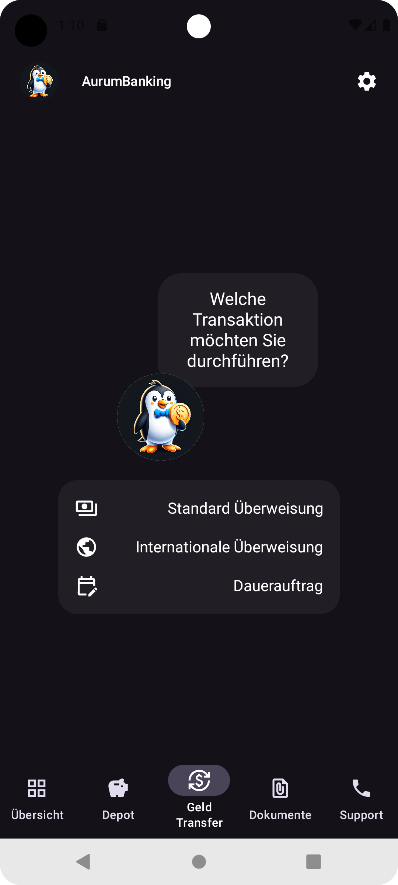
        <figcaption>Screenshot of the main transaction view</figcaption>
    </figure>

<h4>Transaction Options</h4>

<ul>
    <li><strong>Standard Transfer</strong>:  
        This option allows users to perform a regular domestic bank transfer.
    </li>
    <li><strong>International Transfer</strong>:  
        Users can choose this option to send money to an account in a different country.
    </li>
    <li><strong>Permanent Order</strong>:  
        This option lets users set up a permanent order, which will regularly send a specified amount of money to a designated account.
    </li>
</ul>

    <figure style="margin: 10px;">
        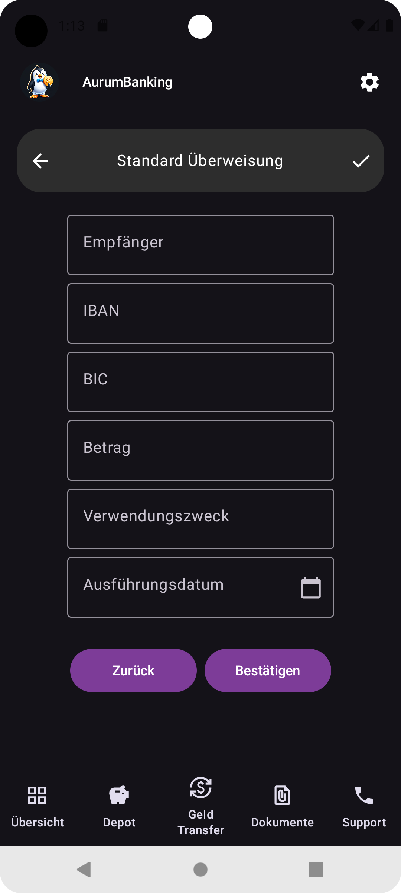
        <figcaption>Screenshot of the standard transaction screen</figcaption>
    </figure>

    <figure style="margin: 10px;">
        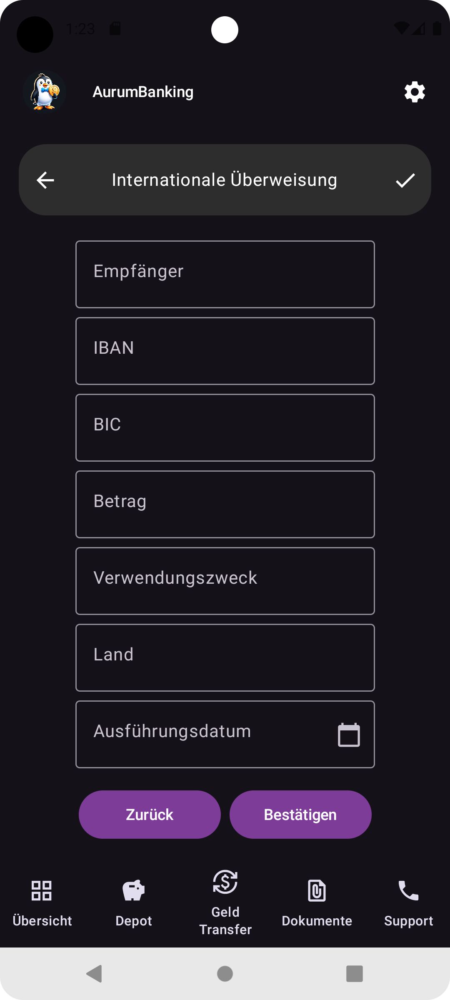
        <figcaption>Screenshot of the international transaction screen</figcaption>
    </figure>

    <figure style="margin: 10px;">
        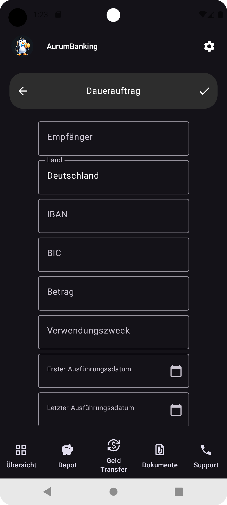
        <figcaption>Screenshot of the permanent transaction screen</figcaption>
    </figure>

<h3>Standard Transfer</h3>

 The <code>StandardTransferScreen</code> is specifically designed for domestic transfers. It offers a straightforward form where users can enter the necessary details to complete their transaction. 

<h4>Key Features</h4>

<ul>
    <li><strong>Recipient</strong>: Users must enter the name of the person or entity they are transferring money to.</li>
    <li><strong>IBAN</strong>: The International Bank Account Number (IBAN) of the recipient is required for the transaction.</li>
    <li><strong>BIC</strong>: The Bank Identifier Code (BIC) is another crucial piece of information for ensuring the transfer reaches the correct destination.</li>
    <li><strong>Amount</strong>: Users specify the amount they wish to transfer.</li>
    <li><strong>Purpose</strong>: An optional field where users can describe the reason for the transfer.</li>
    <li><strong>Execution Date</strong>: Users can select the date on which they want the transaction to be executed. This is particularly useful for scheduling future payments.</li>
</ul>

<h4>Validation and Error Handling</h4>

<ul>
    <li> The screen includes robust validation to ensure that all required fields are correctly filled out before the user can proceed.</li>
    <li> If a field is incorrectly filled or left blank, the user receives immediate feedback via highlighted fields and an error message.</li>
    <li> This validation process is crucial for preventing errors that could delay or fail the transaction.</li>
</ul>

<h4>Form Submission</h4>

<ul>
    <li> Once all required fields are validated, the user can submit the form to initiate the transfer.</li>
    <li> If the submission is successful, the user is redirected to a confirmation screen, affirming that their transaction is being processed.</li>
    <li> In case of a failure, a clear error message is displayed, allowing the user to understand what went wrong and take corrective action.</li>
</ul>

<h4>Edit and Review Mode</h4>

<ul>
    <li> Allows users to review and edit input details before final submission.</li>
</ul>

<h3>International Transfer</h3>

 The <code>International Transfer</code> screen is tailored for cross-border transactions, requiring additional input: 

<h4>Key Features</h4>

<ul>
    <li><strong>Country</strong>: Users must select the country to which they are transferring money.</li>
    <li><strong>Recipient</strong>: Users enter the name of the person or entity they are transferring money to.</li>
    <li><strong>IBAN</strong>: The International Bank Account Number (IBAN) of the recipient, which is crucial for the transaction.</li>
    <li><strong>BIC</strong>: The Bank Identifier Code (BIC) necessary to route the transfer to the correct bank.</li>
    <li><strong>Amount</strong>: Users specify the amount they wish to transfer.</li>
    <li><strong>Purpose</strong>: An optional field where users can describe the reason for the transfer.</li>
    <li><strong>Execution Date</strong>: The date on which the transaction is to be executed. This field is required and allows for future scheduling.</li>
</ul>

<h4>State Management</h4>

<ul>
    <li><strong>Editable State</strong>: The screen includes a toggle for editing mode, allowing users to either review or modify the details before confirming the transaction.</li>
    <li><strong>Error Handling</strong>: The <code>validateInput</code> function checks all fields for correctness, highlighting any issues directly in the UI by changing the border color of the problematic input fields.</li>
    <li><strong>Snackbar Notifications</strong>: If a user tries to submit the form with errors or if the transaction fails, a Snackbar message appears to inform the user.</li>
</ul>

<h4>Transaction Logic</h4>

<ul>
    <li><strong>Form Validation</strong>: Before submitting, the form is validated to ensure that all required fields are filled out. This is managed by checking the state of each input field and applying necessary validation rules.</li>
    <li><strong>ViewModel Interaction</strong>: The <code>TransferViewModel</code> handles the logic of creating and submitting a new transaction request. If the request is successful, the user is navigated to a success screen; otherwise, an error message is displayed via Snackbar.</li>
    <li><strong>Navigation</strong>: Upon successful validation and submission, the screen navigates the user to the <code>SuccessfulTransaction</code> route.</li>
</ul>

<h3>Permanent Order Transfer</h3>

<h4>Function Definition</h4>

 The <code>Permanent Order</code> screen allows users to set up recurring transactions. 

<h4>Key Features</h4>

<ul>
    <li><strong>Country</strong>: Stores the selected country for the transfer. Defaults to "Deutschland".</li>
    <li><strong>Recipient</strong>: Stores the name of the recipient of the transfer.</li>
    <li><strong>IBAN</strong>: Stores the IBAN (International Bank Account Number) of the recipient.</li>
    <li><strong>BIC</strong>: Stores the BIC (Bank Identifier Code) of the recipient's bank.</li>
    <li><strong>Amount</strong>: Stores the amount of money to be transferred.</li>
    <li><strong>Purpose</strong>: Stores the purpose or reference of the transfer.</li>
    <li><strong>First Execution Date</strong>: Stores the date for the first execution of the transfer.</li>
    <li><strong>Last Execution Date</strong>: Stores the date for the last execution of the transfer.</li>
    <li><strong>Transaction Classification</strong>: Stores the classification of the transaction, defaulted to "Dauerauftrag" (standing order).</li>
</ul>

<h4>State Management and Validation</h4>

<ul>
    <li><strong>isEditable</strong>: Controls whether the input fields are editable.</li>
    <li><strong>showSnackbar</strong>: Controls the visibility of the Snackbar for displaying messages.</li>
    <li><strong>snackbarMessage</strong>: Stores the message to be displayed in the Snackbar.</li>
    <li><strong>errorFields</strong>: Keeps track of the fields that have validation errors.</li>
</ul>

<h4>User Interface Elements</h4>

<ul>
    <li><strong>TransferInteractionScreenBar</strong>: A custom app bar that provides options to toggle edit mode and confirm the transaction.</li>
    <li><strong>OutlinedTextField</strong>: Used for input fields like recipient, country, IBAN, BIC, amount, and purpose.</li>
    <li><strong>DateChoiceButton</strong>: Custom button to select the first and last execution dates.</li>
    <li><strong>CreateBackOrEditButton</strong>: A button that either allows users to go back or toggle the edit mode.</li>
    <li><strong>CreateConfirmSendButton</strong>: A button that confirms the transaction and sends the data to the ViewModel for processing.</li>
</ul>

<h3>Handling Incomplete or Invalid Form Inputs</h3>

 In the transfer interaction screen, proper validation of user inputs is crucial to ensure that all required fields are completed and valid before proceeding. When a user attempts to submit the form with incomplete or invalid information, the system performs a series of checks. 

<h4>Process Overview</h4>

<ul>
    <li>Validation Check: The system checks all required fields to verify their completeness. This includes fields such as country, recipient, IBAN, BIC, amount, purpose, and execution dates.</li>
    <li>Error Notification: If any fields are empty or invalid, the user is notified through a snackbar message. This message typically prompts the user to correct the missing or incorrect information.</li>
    <li>UI Feedback: The interface provides visual feedback to guide the user in correcting the errors. This often involves highlighting the problematic fields or displaying specific error messages.</li>
</ul>

<h3>Screens in White Mode</h3>

 The app offers the option to switch to White Mode, providing a bright and clear user interface. 

    <figure style="margin: 10px;">
        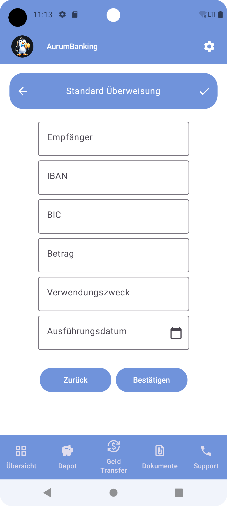
        <figcaption>Screenshot of the standard transaction screen in Whitemode</figcaption>
    </figure>

    <figure style="margin: 10px;">
        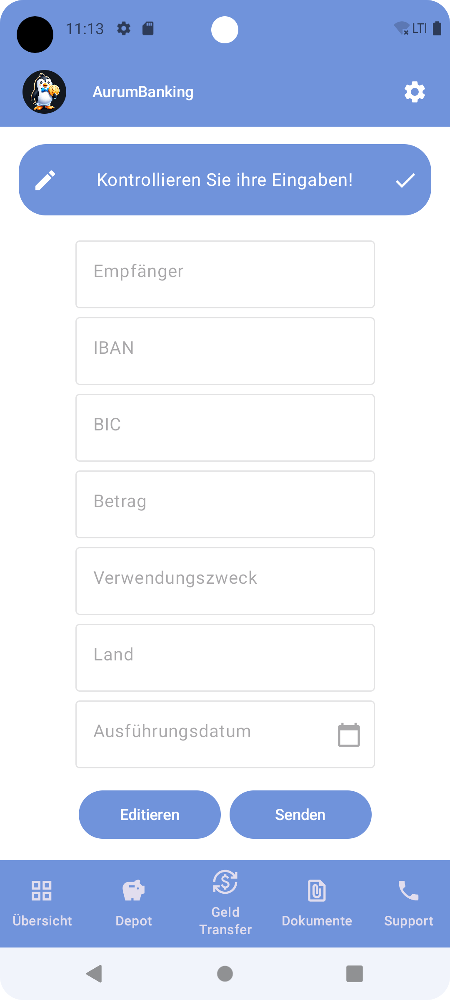
        <figcaption>Screenshot of the international transaction screen in Whitemode</figcaption>
    </figure>

    <figure style="margin: 10px;">
        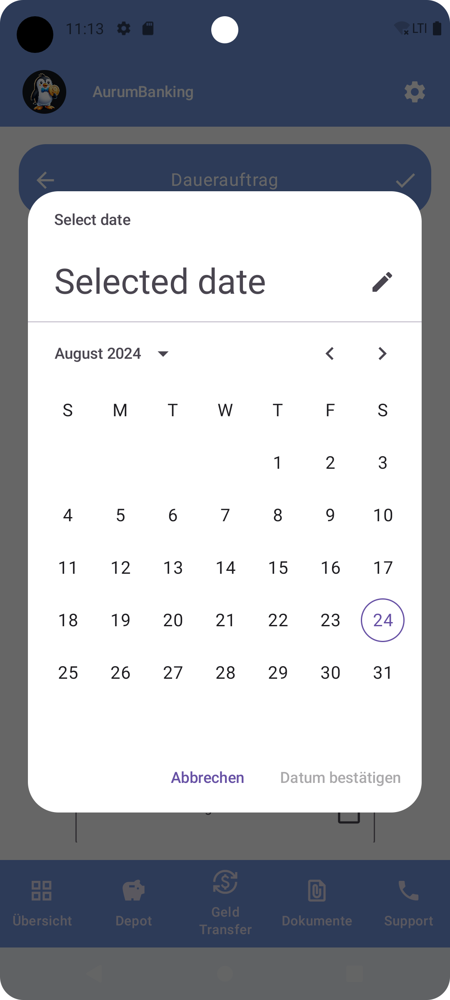
        <figcaption>Screenshot of the permanent transaction screen in Whitemode</figcaption>
    </figure>

## Document-Screen

 Document-Screen 

<h3> Document-Overview-Screen </h3>

When you click on <strong>Dokumente</strong> in the navigation bar of the app, you are taken to the overview page of the Documents screen. 
Here, you can choose between <strong>Posteingang</strong>, <strong>Dokumente abfotografieren</strong> , <strong>Dokumente Scann</strong> und <strong>Kontoauszug.</strong> 

<figure>
    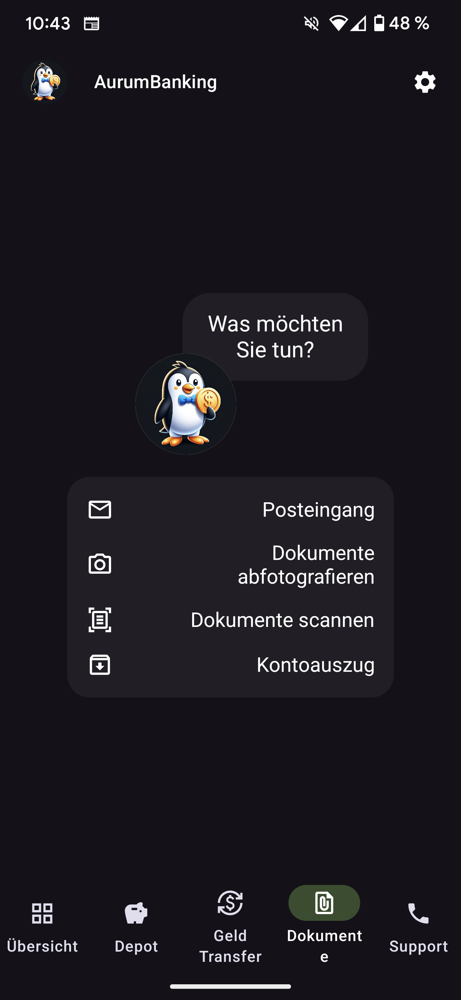
    <figcaption>Document-Overview-Screen</figcaption>
</figure>

<h3> Document-Inbox-Screen </h3>

When you then press <strong>Inbox</strong>,
you are taken to the Inbox screen, where incoming messages are displayed. 
The data shown are local data generated during the runtime of the app. 
This simply returns a list of inbox data to the screen.
If you click on the Inbox-Icon the app will navigate you to the <strong>Inbox-Detail-Screen</strong> 

<figure>
    
    <figcaption>Inbox-Screen</figcaption>
</figure>

<figure>
    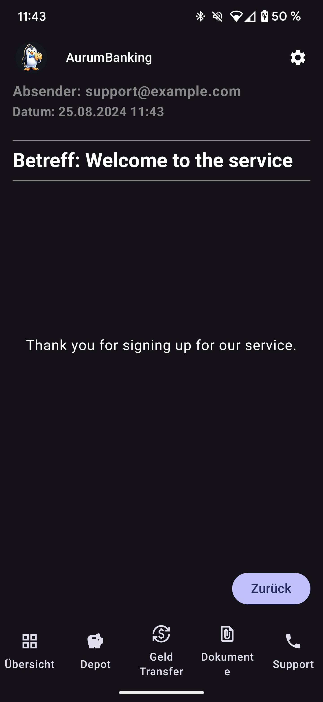
    <figcaption>Inbox-Detail-Screen</figcaption>
</figure>

When you then press <strong>Inbox</strong>,
you are taken to the Inbox screen, where incoming messages are displayed. 
The data shown are local data generated during the runtime of the app. 
This simply returns a list of inbox data to the screen.
When you click on the Inbox-Icon the app will navigate you to the <strong>Inbox-Detail-Screen</strong> 

<h3> Document-Photograph-Screen </h3>

When you want to navigate to the <strong>Dokumente abfotografieren</strong> section. This will open a new pop-up which ask you the permission to use the camera. 

After you give the app the permission to use the camera, the app will show a windows where you can use the camera to capture an image. 
The image will be stored in on the device media in the directory <strong>AurumBanking.</strong> 

<figure>
    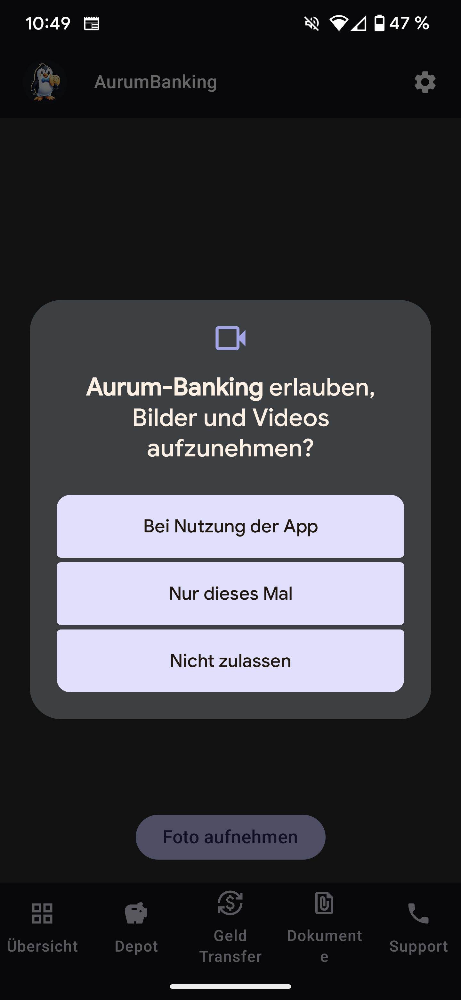
    <figcaption>Camera Permission-Request</figcaption>
</figure>

<figure>
    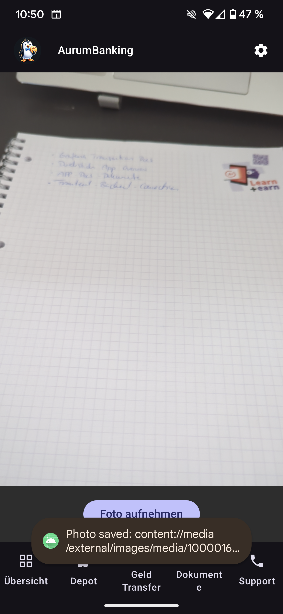
    <figcaption>Camera View</figcaption>
</figure>

<figure>
    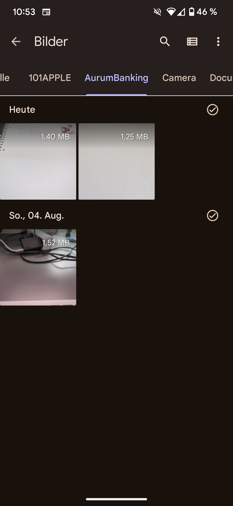
    <figcaption>Device Storage <strong>AurumBanking</strong> </figcaption>
</figure>

If you denied the permission for the camera the following screen will appear. And you can't use the camera until you give the app the permission to use the camera. 

<figure>
    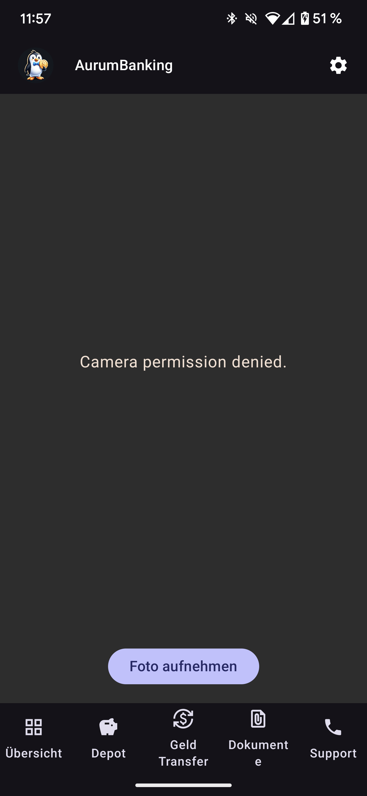
    <figcaption> Camera Permission Denied </figcaption>
</figure>

<h3> Document-Scan-Screen </h3>

If you click on the <strong>Dokumente scannen</strong> section. This will open a scan utilities. 
The tool will automatically scan documents for you. 
After you scan the object it will save the file on the local device storage in the folder <strong>AurumBanking</strong> as PDF-File.
Besides that you have many option to edit your taken file.

This scan utilities is provided by google for android apps. For more information you can read the following <a href="https://developers.google.com/ml-kit/vision/doc-scanner?hl=de">ML Kit official documentation</a>.

<figure>
    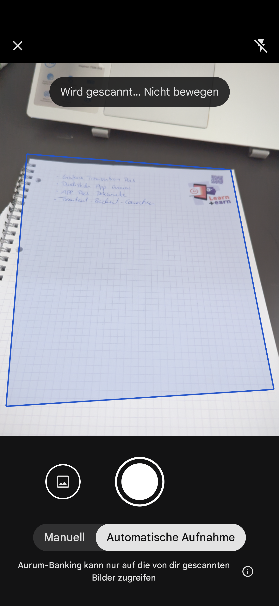
    <figcaption> Scanning - Process </figcaption>
</figure>

<figure>
    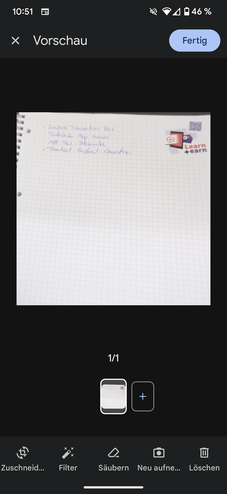
    <figcaption> Scan-Result </figcaption>
</figure>

<figure>
    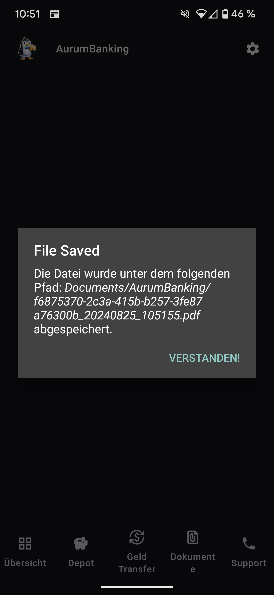
    <figcaption> File save on local storage </figcaption>
</figure>

<h3> Document-Export-Screen </h3>

 The last functionality of the Document-View of the App is the document export. 

 The <strong>Document-Export-Screen</strong> consist of 3 Textfield, option-field and one export-button.

<figure>
    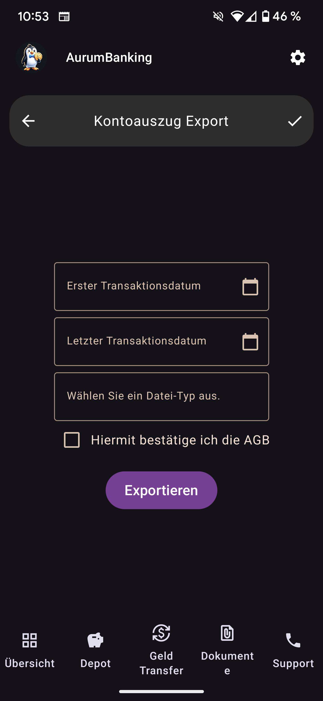
    <figcaption> Document-Export-Screen </figcaption>
</figure>

 
The user must fill in all fields and confirm the option in order to perform an export. 
When they click on the <strong>Erste Transaktionsdatum</strong> or <strong>Letzte Transaktionsdatum</strong> fields, a DateTimePicker is triggered, allowing them to select the date and time.

<figure>
    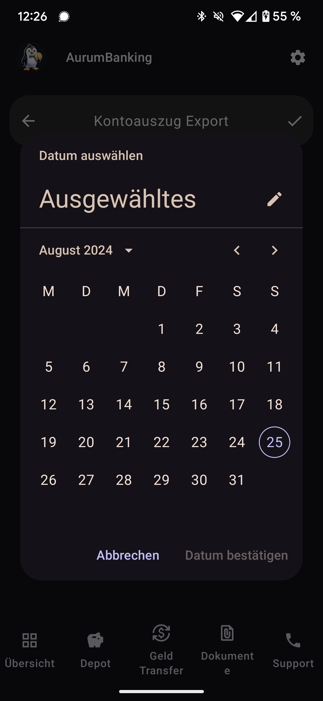
    <figcaption> DateTimePicker </figcaption>
</figure>

<figure>
    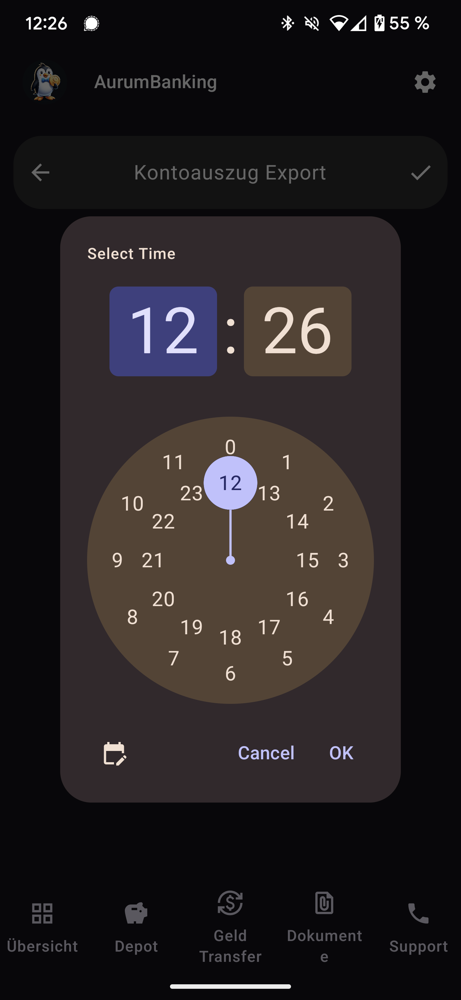
    <figcaption> DateTimePicker </figcaption>
</figure>

<figure>
    
    <figcaption> Shorted DateTimePicker </figcaption>
</figure>

<figure>
    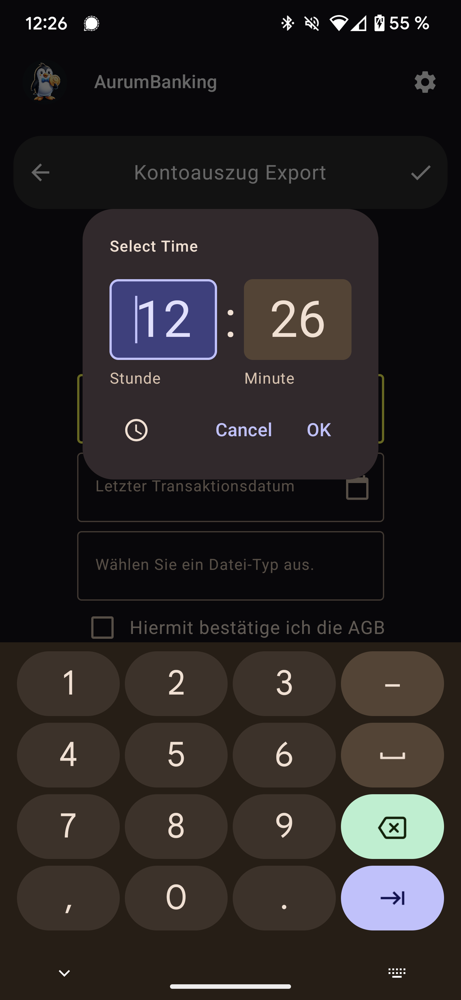
    <figcaption> Shorted DateTimePicker </figcaption>
</figure>

<figure>
    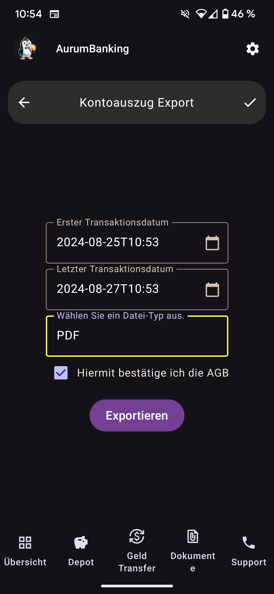
    <figcaption> Completed Export Form </figcaption>
</figure>

If not all fields are filled in, the user will receive an error notification, and the missing field will be highlighted in red.

<figure>
    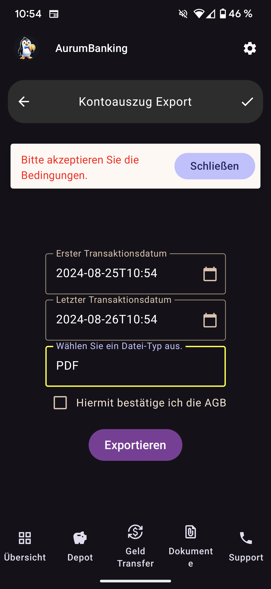
    <figcaption> Error Missing Check Option-Field </figcaption>
</figure>
<figure>
    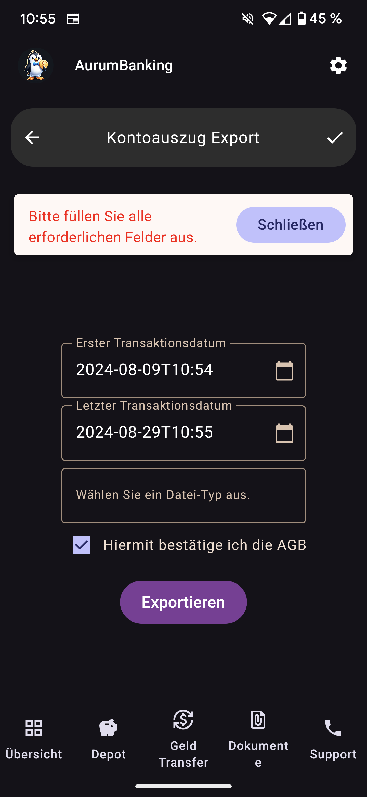
    <figcaption> Error Missing Required Field </figcaption>
</figure>

<figure>
    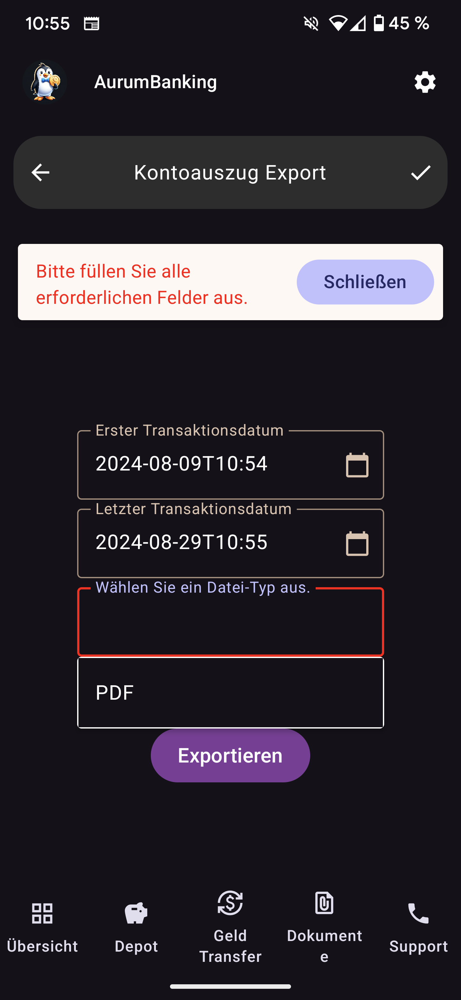
    <figcaption> UI Error Missing Required Field </figcaption>
</figure>

If the export is successfully completed, the user will be informed, and the export will create a PDF file, which will be saved locally.

<figure>
    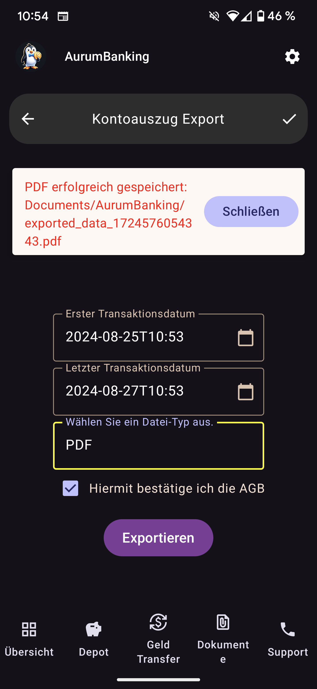
    <figcaption> Successful Export </figcaption>
</figure>

<figure>
    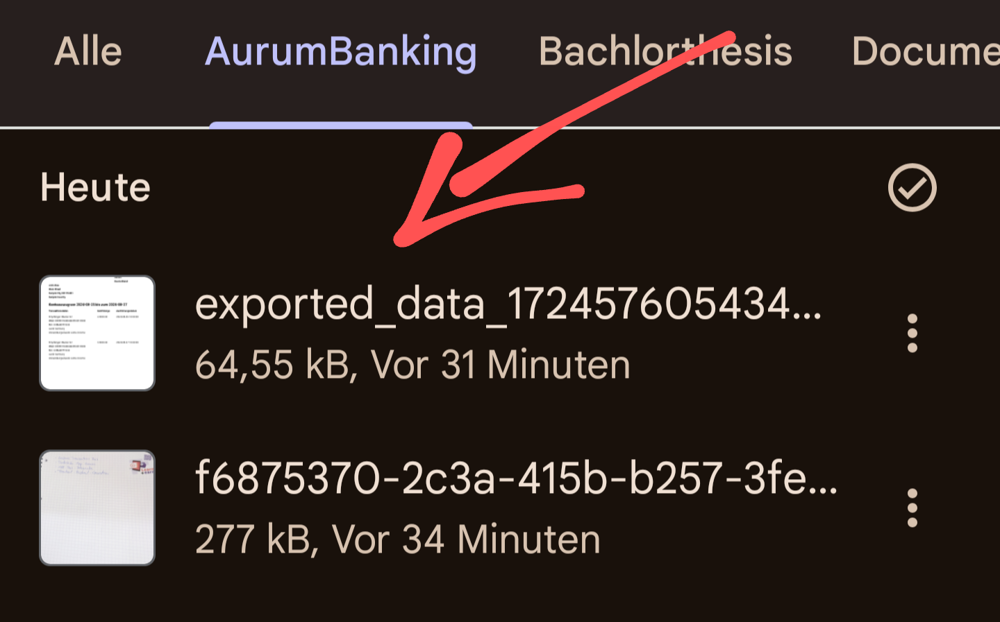
    <figcaption> Local Export Storage </figcaption>
</figure>

<figure>
    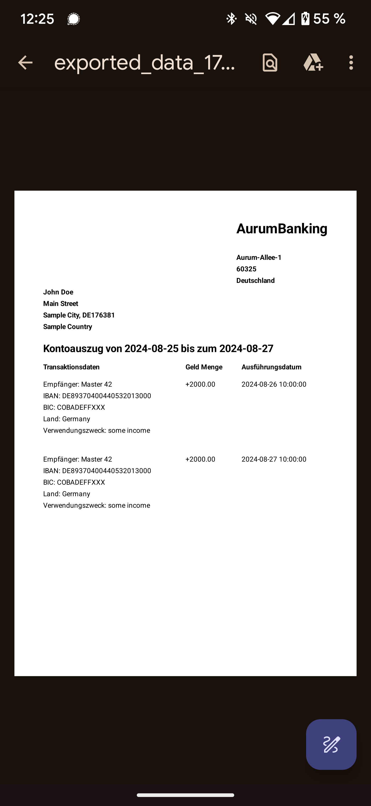
    <figcaption> The PDF-Result of the Export </figcaption>
</figure>

## Support-Screen

Support Screen 

<h3> Support Option View </h3>

    <figure>
        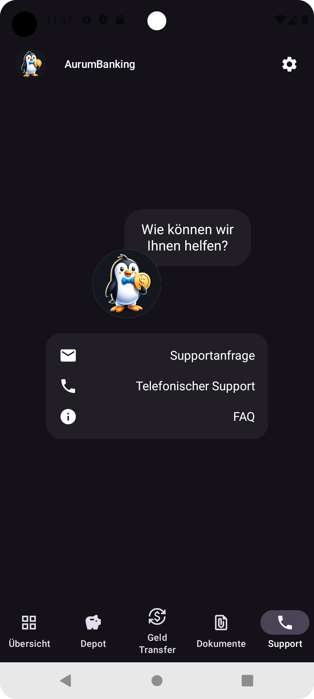
        <figcaption>Screenshot of the main support view</figcaption>
    </figure>

<h3> Support Option View </h3>

 The <strong>Support Option View</strong> in the AurumBanking app is designed to provide users with various options to resolve any issues or answer questions quickly and efficiently. 

<h4> Options: </h4>

<ol>
    <li><strong>Support Inquiry</strong>:  
        Tap the mail icon to send a direct support request.
    </li>
    <li><strong>Phone Support</strong>:  
        Users can choose to contact customer support by phone. Tapping opens the integrated telephone app on the used mobile device. The number is automatically inserted.
    </li>
    <li><strong>FAQ Section</strong>:  
        The information icon leads users to the frequently asked questions (FAQ) section.
    </li>
</ol>

<h3> Support Request View </h3>

    <figure style="margin: 10px;">
        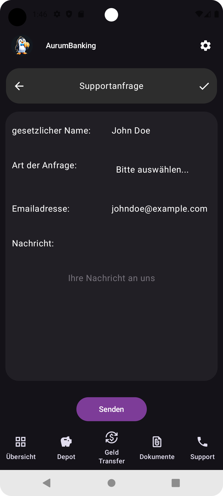
        <figcaption>Screenshot of the support request screen</figcaption>
    </figure>

    <figure style="margin: 10px;">
        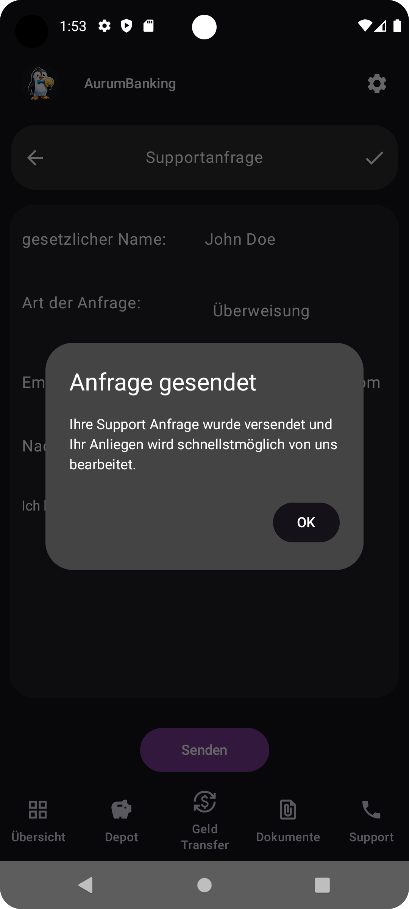
        <figcaption>Screenshot of the error message</figcaption>
    </figure>

    <figure style="margin: 10px;">
        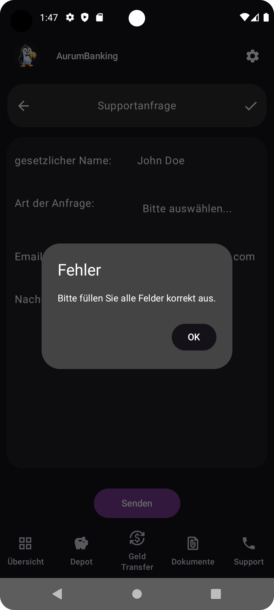
        <figcaption>Screenshot of the success message</figcaption>
    </figure>

<h4> Support Request Screen </h4>

 This screen allows users to submit a support request by filling out the necessary information. The user can enter their legal name, the type of inquiry, their email address, and a message detailing their issue. 

<ul>
    <li><strong>Legal Name</strong>: The user's legal name, which is provided from the session manager.</li>
    <li><strong>Type of Inquiry</strong>: Users can choose from a dropdown-menu (e.g., Überweisung, Konto, Benutzerdaten).</li>
    <li><strong>Email Address</strong>: The user's contact email address, which also is provided.</li>
    <li><strong>Message</strong>: A text field where the user can enter their specific issue or question.</li>
</ul>

 At the bottom, there is a <strong>Send</strong> button that the user can tap to submit the support request. When the button is clicked, the user inputs get checked. For example the message field must be filled and the type must be selected.
At the top is a small menu bar with a check icon with the same functionality as the "senden" button 
 

<h4> Support Request Submitted (Success) Screen </h4>

 Once the user successfully submits their support request, a confirmation popup appears to inform them that their request has been received. This dialog reassures the user that their inquiry is being processed. 

<ul>
    <li><strong>Confirmation Message</strong>: "Anfrage gesendet" — informs the user that the support request has been sent.</li>
    <li><strong>Details</strong>: The message also states that the request will be processed as quickly as possible.</li>
</ul>

 The user can tap <strong>OK</strong> to dismiss the popup and return to the app. 
>

<h4> Support Request Error (Failure) Screen </h4>

If there are any issues with the support request submission (e.g., missing required fields), the user is shown an error popup. This message prompts the user to complete the missing information.

<ul>
    <li><strong>Error Message</strong>: "Fehler" — indicates that an error occurred during the submission process.</li>
    <li><strong>Details</strong>: The message encourages the user to "Bitte füllen Sie alle Felder korrekt aus." (Please fill out all fields correctly).</li>
    <li><strong>Sending Error</strong>: If there is an error from sending, there is a different error message to inform the user.</li>
</ul>

The user can tap <strong>OK</strong> to dismiss the error and return to the form to correct the mistakes.

<h3> Support Sub Screens </h3>

    <figure style="margin: 10px;">
        
        <figcaption>Screenshot of the FAQ screen</figcaption>
    </figure>

    <figure style="margin: 10px;">
        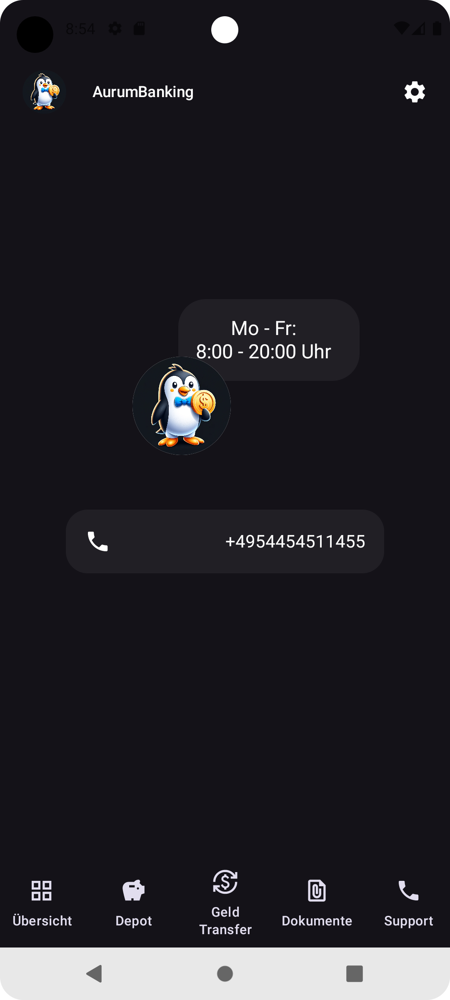
        <figcaption>Screenshot of the telephone support</figcaption>
    </figure>

    <figure style="margin: 10px;">
        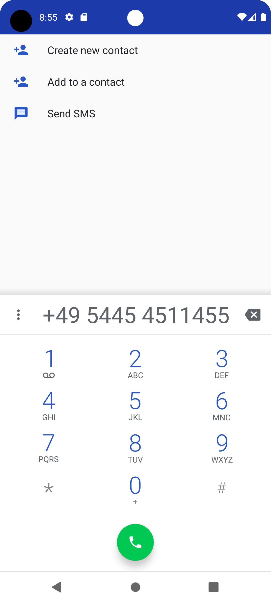
        <figcaption>Screenshot of telephone app screen</figcaption>
    </figure>

<h4> FAQ Screen </h4>

 This screen provides users with a Frequently Asked Questions (FAQ) section, helping them resolve common issues and inquiries. Users can expand the questions to read answers about setting up their account, the security of the app, and how to transfer money to another account. 

<strong> Key Elements: </strong>

<ul>
    <li><strong>FAQ Cards</strong>: The screen displays collapsible cards for each FAQ topic.</li>
    <li><strong>Questions Addressed</strong>:
        <ul>
            <li>Setting up a new account in the app.</li>
            <li>Security measures to protect the account.</li>
            <li>Transferring money to another account.</li>
        </ul>
    </li>
</ul>

<h4> Telephone Support Screen </h4>

 This screen allows users to access AurumBanking's telephone support. The app provides the contact information, including the phone number and business hours (Monday to Friday, 8:00 - 20:00), enabling users to get direct support from customer service.

<ul>
    <li><strong>Key Elements</strong>:</li>
    <ul>
        <li><strong>Phone Number Display</strong>: The contact number for customer service.</li>
        <li><strong>Support Hours</strong>: Operating hours are clearly displayed for user reference.</li>
    </ul>
</ul>

<h4> Telephone App Screen </h4>

 This screen shows the user's telephone dialer with the AurumBanking support number pre-filled. From this screen, the user can directly call the support line, create a new contact, add the number to an existing contact, or send an SMS. 

<ul>
    <li><strong>Key Elements</strong>:</li>
    <ul>
        <li><strong>Dial Pad</strong>: The dialer pad with the pre-filled AurumBanking support number.</li>
        <li><strong>Options Menu</strong>: Additional options to create a new contact, add to an existing contact, or send an SMS.</li>
    </ul>
</ul>

<h3> Screens in White Mode </h3>

     <figure style="margin: 10px;">
        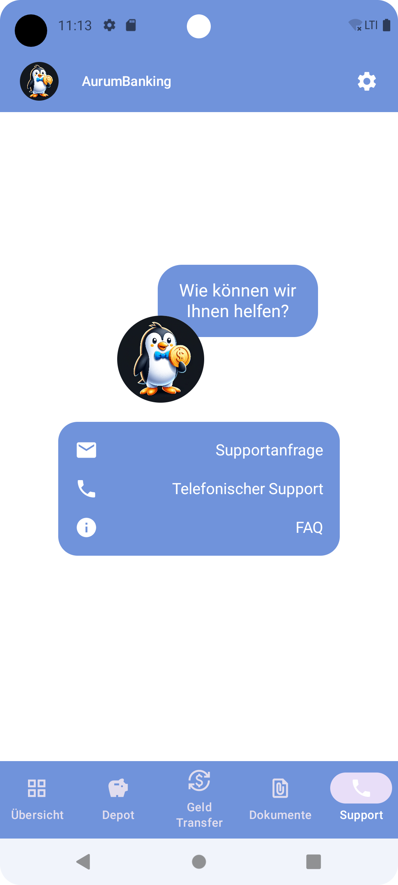
        <figcaption>Screenshot the support main view in whitemode</figcaption>
    </figure>

    <figure style="margin: 10px;">
        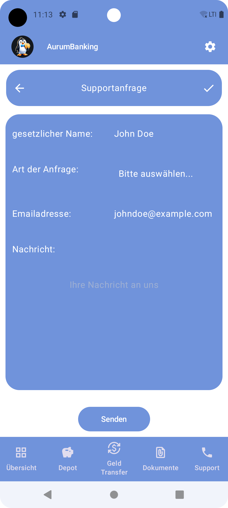
        <figcaption>Screenshot of the support request screen in whitemode</figcaption>
    </figure>   

    <figure style="margin: 10px;">
        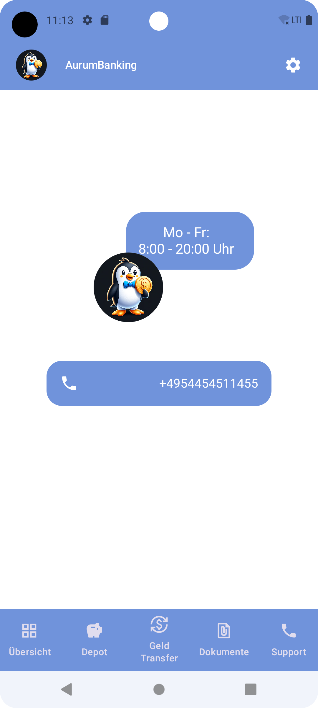
        <figcaption>Screenshot of the telephone support in whitemode</figcaption>
    </figure>

## Settings-Screen

 Settings Screen 

<h3> Settings Option Screen in AurumBanking App </h3>

    <figure style="margin-right: 20px;">
        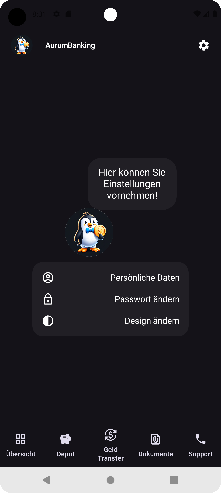
        <figcaption>Screenshot of the settings option screen</figcaption>
    </figure>
    
    <figure>
        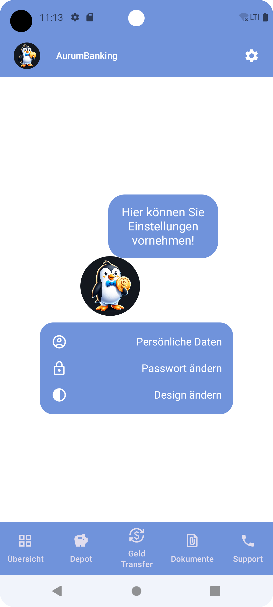
        <figcaption>Screenshot of the settings option screen in white mode</figcaption>
    </figure>

    The <strong>Settings Option Screen</strong> in the <strong>AurumBanking</strong> app serves as the main hub for users to manage their personal settings. From this screen, the user can access various important functions related to their account and the app's appearance.

<h4> Overview of the Settings Option Screen </h4>

 Upon accessing the settings screen, the user is greeted by the app's mascot and a friendly prompt: **"Hier können Sie Einstellungen vornehmen!"**, which translates to "Here you can make settings!" in English. Below this prompt, the user is presented with three main options:

<ul>
    <li><strong>Personal Data (Persönliche Daten)</strong>: Allows the user to view and edit their personal information, such as their name, address, and contact details.</li>
    <li><strong>Change Password (Passwort ändern)</strong>: Provides a secure method for the user to change their account password.</li>
    <li><strong>Change Design (Design ändern)</strong>: Enables the user to switch between different design modes (e.g., light and dark mode) for the app's appearance.</li>
</ul>

<h4> Additional Notes </h4>

<ul>
    <li>This screen acts as a central location for managing account settings and appearance options within the app.</li>
    <li>The user can quickly access this screen by tapping the gear icon located in the top right corner of the main screen.</li>
</ul>

<h3> Change To Whitemode Screen </h3>

    <figure>
        
        <figcaption>gif of changing to whitemode</figcaption>
    </figure>

The <strong>AurumBanking</strong> app provides a setting option to change the visual design of the app. This allows the user to switch between different themes, such as a light or dark mode, depending on their preference.

<h4>Overview of the White Mode Setting</h4>

The white mode (or light mode) setting is accessible from the <strong>Settings</strong> screen within the AurumBanking app. Upon selecting this option, the user interface of the app transitions to a lighter color palette, making it easier to view in well-lit environments.

By selecting the <strong>Möchten Sie auf White-Mode/Dark-Mode wechseln</strong> option, the user can alter the appearance of the app. The app will ask for confirmation, and after clicking <strong>"verstanden"</strong>, the app will switch to the desired mode.

<h3> Change Password Screen in AurumBanking App </h3>

    
    <figure style="margin-right: 20px;">
        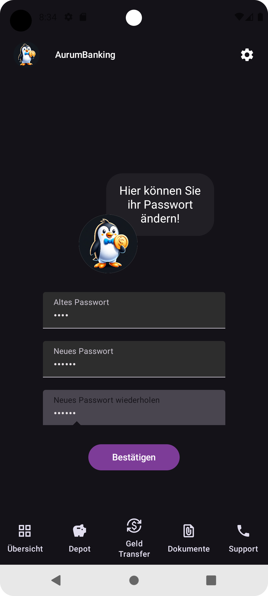
        <figcaption>Screenshot of the new password screen</figcaption>
    </figure>
    
    <figure>
        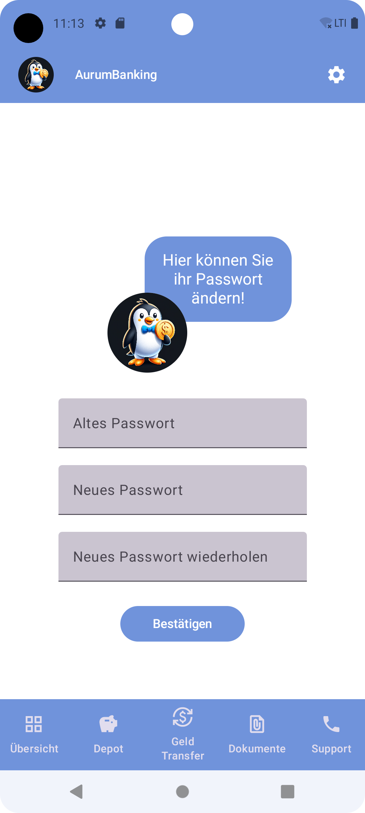
        <figcaption>Screenshot of the new password screen in white mode</figcaption>
    </figure>
    

<h4> Change Password Screen in AurumBanking App </h4>

The <strong>Change Password Screen</strong> in the <strong>AurumBanking</strong> app allows users to securely update their account password. This screen provides an intuitive and user-friendly interface for changing the password in three simple steps.

<h4> Overview of the Change Password Screen </h4>

Upon accessing this screen, the user is prompted with the message <strong>"Hier können Sie ihr Passwort ändern!"</strong>, which translates to "Here you can change your password!" in English.

The user is presented with three fields:

<ul>
    <li><strong>Old Password (Altes Passwort)</strong>: The user enters their current password.</li>
    <li><strong>New Password (Neues Passwort)</strong>: The user enters a new password they would like to set.</li>
    <li><strong>Repeat New Password (Neues Passwort wiederholen)</strong>: The user repeats the new password for confirmation.</li>
</ul>

At the bottom, the user can tap the <strong>"Bestätigen"</strong> (Confirm) button to complete the password change process.

<h4> Additional Notes </h4>

<ul>
    <li>The change password process is designed to ensure security, requiring the user to input their old password before confirming the new one.</li>
    <li>This screen can be accessed from the <strong>Settings</strong> menu by selecting the <strong>Change Password</strong> option.</li>
</ul>

<h3> Personal Data Screen in AurumBanking App </h3>

    
    <figure style="margin-right: 20px;">
        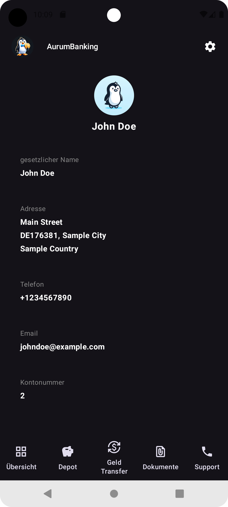
        <figcaption>Screenshot of settings personal data</figcaption>
    </figure>
    
    <figure>
        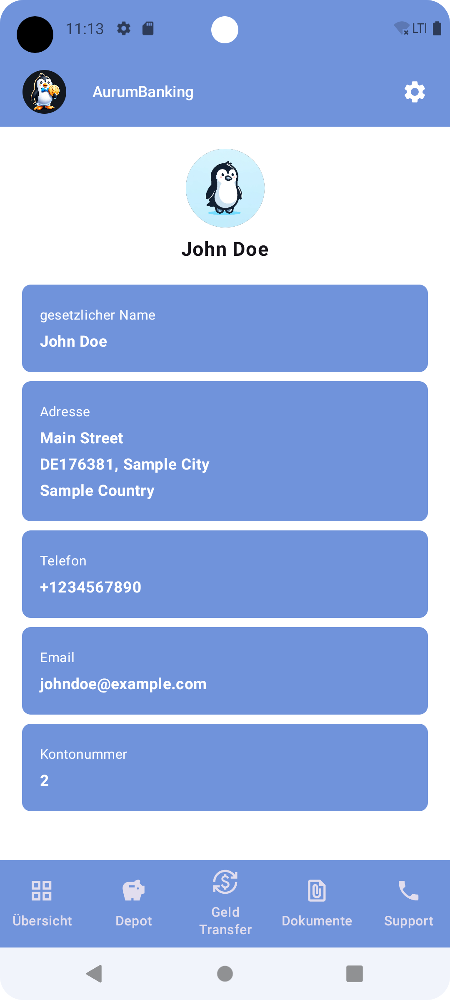
        <figcaption>Screenshot of settings personal data in whitemode</figcaption>
    </figure>
    

The <strong>Personal Data Screen</strong> in the <strong>AurumBanking</strong> app allows the user to view their account information in a detailed and structured format. This screen provides essential details about the user's account, such as their legal name, address, contact information, and account number.

<h4> Overview of the Personal Data Screen </h4>

On this screen, the user can see their information displayed clearly under the following categories:

<ul>
    <li><strong>Profile Picture</strong>: Profile Picture of the user.</li>
    <li><strong>Legal Name</strong>: The full legal name of the account holder.</li>
    <li><strong>Address</strong>: The account holder's address, including street, postal code, city, and country.</li>
    <li><strong>Phone Number</strong>: The user's contact phone number.</li>
    <li><strong>Email Address</strong>: The registered email associated with the user's account.</li>
    <li><strong>Account Number</strong>: The unique account number assigned to the user.</li>
</ul>

<h4> Additional Notes </h4>

<ul>
    <li>The user can access this screen by navigating through the <strong>Settings</strong> menu and selecting the <strong>Personal Data</strong> option.</li>
    <li>All the data shown here is private and secure, ensuring that only the account holder has access to their personal details.</li>
</ul>

