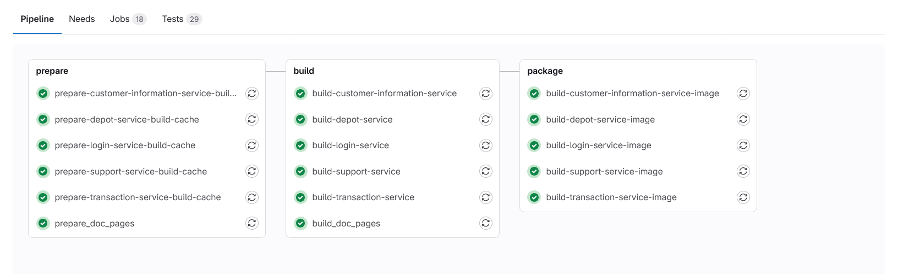
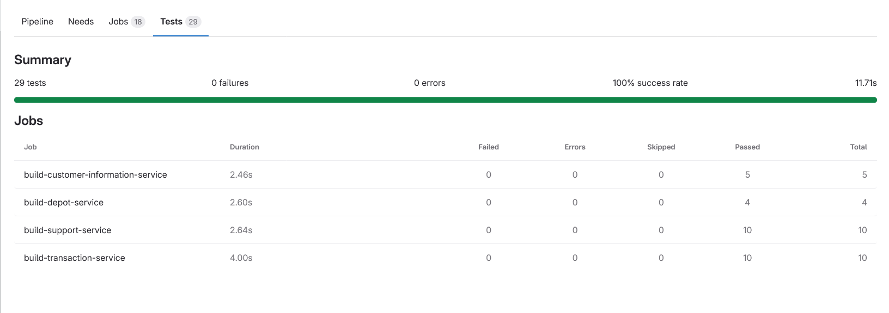
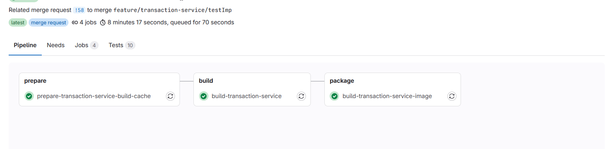
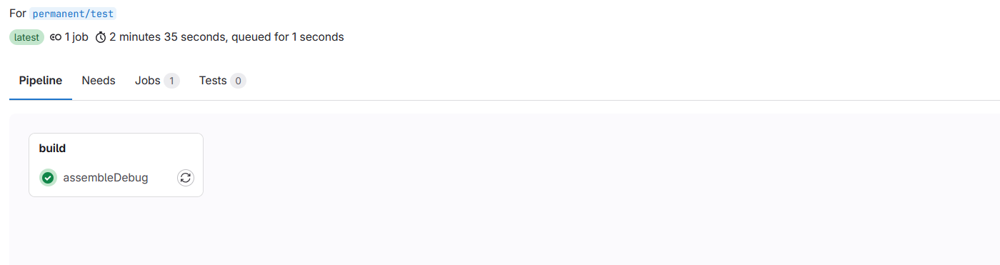

# Pipeline
The configuration pipeline-file for the backand as well as for app can be found on on the root-project folder in:
> Path: .gitlab-ci.yml

Our has 3 stages: 
 - prepare
 - build
 - package

In the following are all the services with pipeline stages:


*Figure 1: This is the pipeline diagram illustrating all services workflow.*

Besides that we are running for each service several tests, you can see those on the pipeline test-result, too.


*Figure 2: Pipeline-Test-Result*


To speed up building and deployment, we are using pipeline runs that execute only the specific service as determined by the pipeline rules. 
These rules, which dictate how and when each part of the pipeline is executed, can be reviewed under the section "Pipeline Running Rules." 
This setup ensures a more efficient use of resources and minimizes the time required for each pipeline execution. 
Detailed information and configurations on how these pipeline runs are controlled 
and optimized for faster and more precise execution of our development and operations processes can be found in that section.


*Figure 3: This is the pipeline diagram illustrating only one workflow with the branch-name matching rule.*

Here you can see the pipeline of the app-frontend:


*Figure 4: App-Pipeline*


## Setup-Pipeline

<details>
<summary>Setup-Pipeline</summary>

<p>The only two different things about the app-gitlab-runner and backend-gitlab-runner are:</p>
<ul>
  <li>app-gitlab-token: <strong>glrt-gzH2v-od7U2MxFuhypb7 </strong> </li>
  <li>app-gitlab runner only runs on protected branches</li>
</ul>

<p><strong> token: </strong></p>
<ul>
  <li>linux: <strong>_glrt-xznuGhoqctjSmbVNxpm_</strong></li>
  <li>windows-hoang: <strong>_glrt-xznuGhoqctjSmbVNxpm_</strong> / <strong>_glrt-aHawSL4WALWi1s6BXdVi_</strong></li>
  <li>steffan-gitlab-runner: <strong>_glrt-Fzfyj9euFsuo1f_szyUo_</strong></li>
  <li>milena-gitlab-runner: <strong>_glrt-pzYxkWTn55mxxy4S4hXA_</strong></li>
  <li>salma-gitlab-runner: <strong>_glrt-sQu4HSKd7RgotJkPHwCn_</strong></li>
</ul>


```bash
docker run --rm -it -v gitlab-runner-config:/etc/gitlab-runner gitlab/gitlab-runner:latest register .\gitlab-runner.exe register --url https://git.ai.fh-erfurt.de --token [$token einfügen]
```
<ul>
  <li>
    Enter the GitLab instance URL (for example, https://gitlab.com/): 
    <strong>[https://git.ai.fh-erfurt.de]: [Enter]</strong>
  </li>
  <li>
    Enter a name for the runner. This is stored only in the local config.toml file: 
    <strong>aurumbanking-gitlab-runner</strong>
  </li>
  <li>
    Enter an executor: parallels, virtualbox, docker, docker-autoscaler, instance, custom, shell, ssh, docker-windows, docker+machine, kubernetes: 
    <strong>docker</strong>
  </li>
  <li>
    Enter the default Docker image (for example, ruby:2.7): 
    <strong>jdk:17</strong>
  </li>
</ul>


```bash
docker run -d --name gitlab-runner --restart always -v /var/run/docker.sock:/var/run/docker.sock -v gitlab-runner-config:/etc/gitlab-runner gitlab/gitlab-runner:latest
```

```bash
docker exec -it gitlab-runner /bin/bash
```

<ul>
  <li>apt update</li>
  <li>apt install nano</li>
  <li>nano /etc/gitlab-runner/config.toml --> set: privileged = true</li>
</ul>

<p align="right">(<a href="#top">back to top</a>)</p>
</details>


## Pipeline Running Rules

<details>
<summary>Pipeline Running Rules</summary>

<h3>Customer Information Service</h3>
<ul>
    <li><strong>Prepare Build Cache</strong>
        <ul>
            <li>Runs for branches matching: <code>feature/customer-information-service</code></li>
            <li>Also runs for the branch: <code>test/permant</code> and <code>main</code></li>
        </ul>
    </li>
    <li><strong>Build</strong>
        <ul>
            <li>Runs for branches matching: <code>feature/customer-information-service</code></li>
            <li>Also runs for the branch: <code>test/permant</code> and <code>main</code></li>
        </ul>
    </li>
    <li><strong>Build Image</strong>
        <ul>
            <li>Runs for branches matching: <code>feature/customer-information-service</code></li>
            <li>Also runs for the branch: <code>test/permant</code> and <code>main</code></li>
        </ul>
    </li>
</ul>

<h3>Depot Service</h3>
<ul>
    <li><strong>Prepare Build Cache</strong>
        <ul>
            <li>Runs for branches matching: <code>feature/depot-service</code></li>
            <li>Also runs for the branch: <code>test/permant</code> and <code>main</code></li>
        </ul>
    </li>
    <li><strong>Build</strong>
        <ul>
            <li>Runs for branches matching: <code>feature/depot-service</code></li>
            <li>Also runs for the branch: <code>test/permant</code> and <code>main</code></li>
        </ul>
    </li>
    <li><strong>Build Image</strong>
        <ul>
            <li>Runs for branches matching: <code>feature/depot-service</code></li>
            <li>Also runs for the branch: <code>test/permant</code> and <code>main</code></li>
        </ul>
    </li>
</ul>

<h3>Login Service</h3>
<ul>
    <li><strong>Prepare Build Cache</strong>
        <ul>
            <li>Runs for branches matching: <code>feature/login-service</code></li>
            <li>Also runs for the branch: <code>test/permant</code> and <code>main</code></li>
        </ul>
    </li>
    <li><strong>Build</strong>
        <ul>
            <li>Runs for branches matching: <code>feature/login-service</code></li>
            <li>Also runs for the branch: <code>test/permant</code> and <code>main</code></li>
        </ul>
    </li>
    <li><strong>Build Image</strong>
        <ul>
            <li>Runs for branches matching: <code>feature/login-service</code></li>
            <li>Also runs for the branch: <code>test/permant</code> and <code>main</code></li>
        </ul>
    </li>
</ul>

<h3>Support Service</h3>
<ul>
    <li><strong>Prepare Build Cache</strong>
        <ul>
            <li>Runs for branches matching: <code>feature/support-service</code></li>
            <li>Also runs for the branch: <code>test/permant</code> and <code>main</code></li>
        </ul>
    </li>
    <li><strong>Build</strong>
        <ul>
            <li>Runs for branches matching: <code>feature/support-service</code></li>
            <li>Also runs for the branch: <code>test/permant</code> and <code>main</code></li>
        </ul>
    </li>
    <li><strong>Build Image</strong>
        <ul>
            <li>Runs for branches matching: <code>feature/support-service</code></li>
            <li>Also runs for the branch: <code>test/permant</code> and <code>main</code></li>
        </ul>
    </li>
</ul>

<h3>Transaction Service</h3>
<ul>
    <li><strong>Prepare Build Cache</strong>
        <ul>
            <li>Runs for branches matching: <code>feature/transaction-service</code></li>
            <li>Also runs for the branch: <code>test/permant</code> and <code>main</code></li>
        </ul>
    </li>
    <li><strong>Build</strong>
        <ul>
            <li>Runs for branches matching: <code>feature/transaction-service</code></li>
            <li>Also runs for the branch: <code>test/permant</code> and <code>main</code></li>
        </ul>
    </li>
    <li><strong>Build Image</strong>
        <ul>
            <li>Runs for branches matching: <code>feature/transaction-service</code></li>
            <li>Also runs for the branch: <code>test/permant</code> and <code>main</code></li>
        </ul>
    </li>
</ul>

<h3>Documentation</h3>
<ul>
    <li><strong>Prepare Documentation Pages</strong>
        <ul>
            <li>Runs for branches matching: <code>docs/</code></li>
            <li>Also runs for the branch: <code>test/permant</code> and <code>main</code></li>
        </ul>
    </li>
    <li><strong>Build Documentation Pages</strong>
        <ul>
            <li>Runs for branches matching: <code>docs/</code></li>
            <li>Also runs for the branch: <code>test/permant</code> and <code>main</code></li>
        </ul>
    </li>
</ul>

<p align="right">(<a href="#top">back to top</a>)</p>
</details>