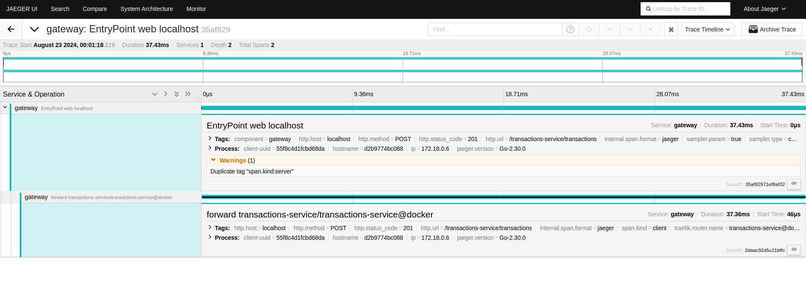
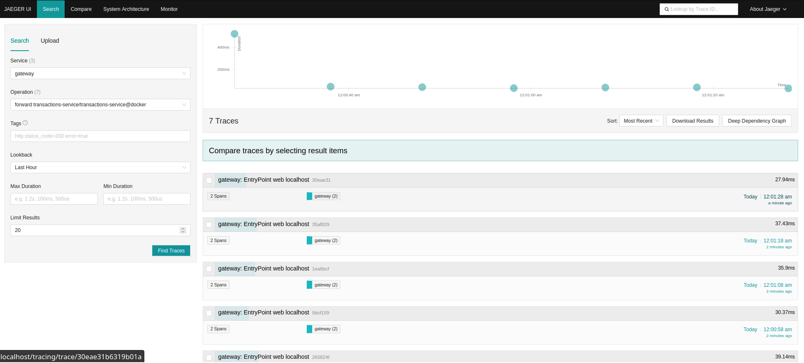
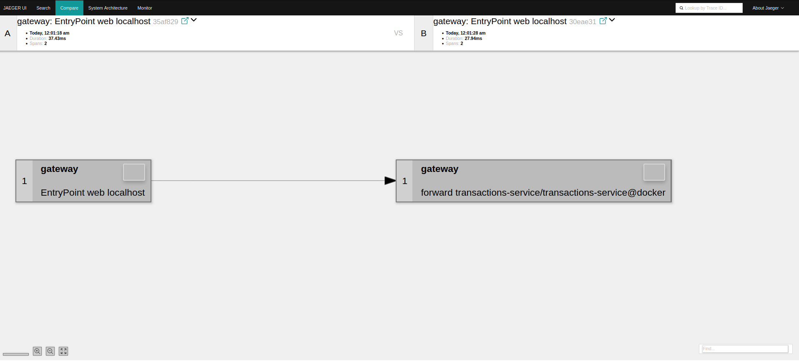

## Jaeger UI / Tracing

If started with the **_-t_** flag, have a look at the Jaeger UI.

> **Path:** [http://localhost/tracing](http://localhost/tracing)

Jaeger is our OpenTelemetry compliant service that collects tracing information from all services comprising our system.
With that data, one is able to examine how requests _move_ through the system, gather insights about processing times as
well as errors that happen along the way.

Here is an example of the 

<figure>
    
    <figcaption>Jaeger main screen showing captured traces</figcaption>
</figure>

<figure>
    
    <figcaption>Jaeger showing a trace graph of the transaction-service. </figcaption>
</figure>

<figure>
    
    <figcaption>Jaeger showing detail of a trace & its spans.</figcaption>
</figure>

