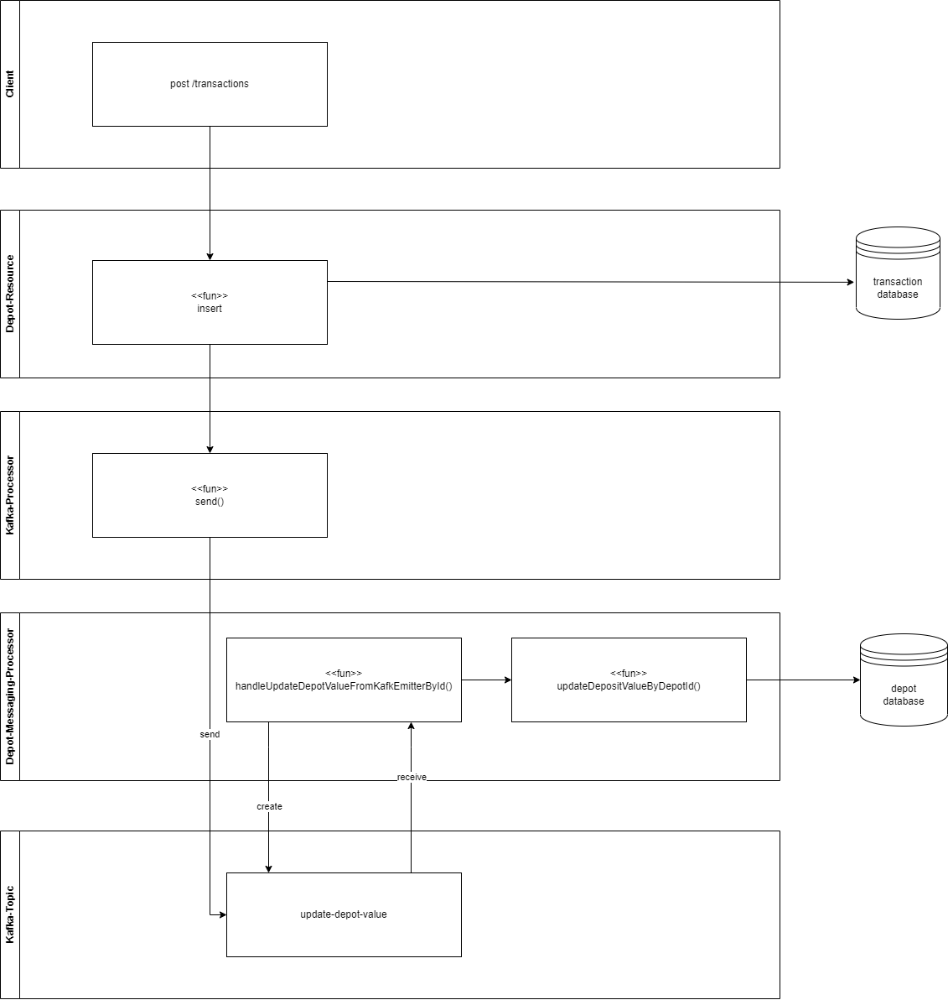
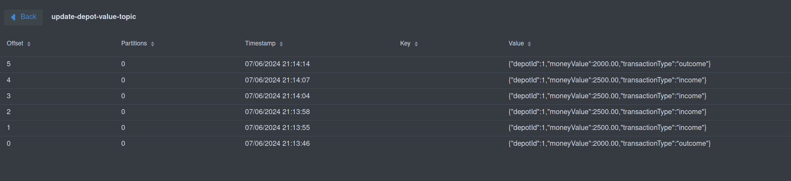

# Kafka-Design

## Kafka Architecture 

 For our project, we use the Kafka topic: <strong> update-depot-value.</strong>
This topic is created by the Depot-Service. 

  When a new transaction is executed through the Transaction-Service and persisted in the database, 
the system sends a transaction message to the topic. 
This message is then consumed by the Depot-Service. 
The Depot-Service reconciles the current depot amount with the transaction value and writes the new depot value to the database. 

In the following image, you can view the architecture of the Kafka integration as well as the incoming transactions in the Quarkus-Kafka-Dev-UI.

<figure>
    
    <figcaption> Kafka internal Architecture Integration the Services </figcaption>
</figure>

<figure>
    
    <figcaption> Transaction-Messages in the Kafka-Topic <strong> update-depot-value </strong>  </figcaption>
</figure>

