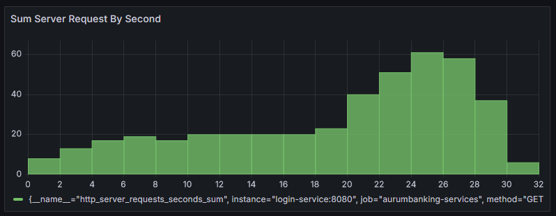
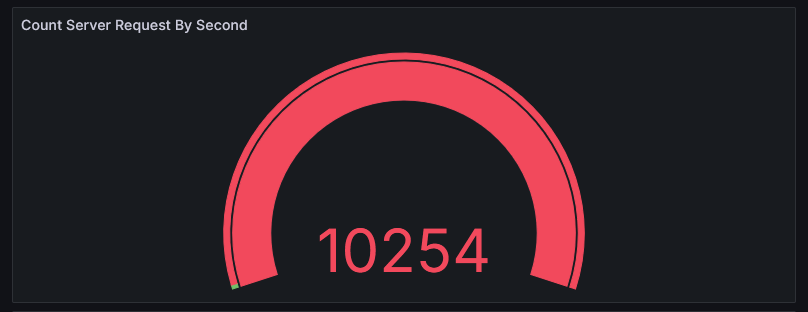
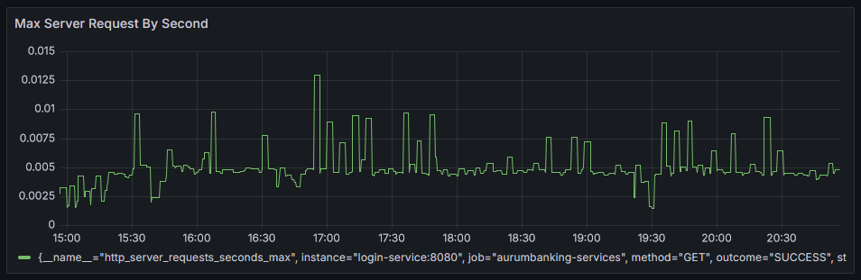

# Prometheus - Metrics 

If started with the **_-m_** flag, have a look at Prometheus, the system that aggregates metric data from all services (
e.g. our own Quarkus services, databases, Traefik and, yes, Prometheus itself).

> **Path on PROD:** [http://localhost/prometheus](http://localhost/prometheus)

    <figure>
        
        <figcaption>Prometheus entry by given path.</figcaption>
    </figure>

Here are some examples which metrics can be provided by Prometheus and can be shown on the Prometheus-Graphs.

    <figure>
        
        <figcaption>Collection of Traefik-Entrypoint Metrics</figcaption>
    </figure>

    <figure>
        
        <figcaption>Collection of Traefik-Entrypoint Metrics</figcaption>
    </figure>

# Grafana - Monitoring

For monitoring purposes, Traefik provides metrics that are collected by a Prometheus server and visualized through Grafana dashboards.

> **Path on PROD:** [http://localhost/metrics-ui-service/login](http://localhost/prometheus)

> username: admin

> password: admin

We have for each of our services a monitoring dashboards. In the following section, we will have a closer look on those dashboards.

## Login-Service

This dashboard provides a clear visualization of key performance metrics related to the login service, using Prometheus as the data source. Each panel is designed to monitor a specific aspect of the service, helping ensure reliability and performance optimization.

### Panel 1: Sum Server Request By Second

This line chart tracks the total number of GET requests per second on the login service. It helps monitor traffic patterns and identify potential issues, such as increased load that may require resource scaling.

<figure>
    
    <figcaption>Screenshot showing the total number of login requests per second</figcaption>
</figure>

### Panel 2: Count of Server Requests Per Second

This gauge displays the current number of server requests per second, helping to quickly assess the real-time load on the service.

<figure>
    
    <figcaption>Screenshot showing the real-time count of server requests per second for the login service.</figcaption>
</figure>

### Panel 3: Max of Server Requests by Second

This line chart visualizes the maximum number of server requests per second over time for the login service. It helps identify peak request rates, enabling the monitoring of potential performance bottlenecks and ensuring that the service can handle traffic spikes effectively.

<figure>
    
    <figcaption>Screenshot showing the maximum number of server requests per second for the login service.</figcaption>
</figure>

## Customer-Information-Service

## Depot-Service

## Transaction-Service

## Support-Service

This dashboard provides a clear visualization of key performance metrics related to the support service, using Prometheus as the data source. Each panel is designed to monitor a specific aspect of the service, helping ensure reliability and performance optimization.

### Panel 1: Successful Support Requests (Max Duration)

This gauge panel shows the maximum processing time for successful support requests (HTTP 200 status). It helps in understanding the performance of the support service, particularly in measuring the longest request times. If the max duration consistently exceeds a certain threshold, this could indicate a performance bottleneck.

<figure>
    
    <figcaption>Screenshot of the max duration for successful support requests</figcaption>
</figure>

### Panel 2: Sum of Support Requests Over Time (Timeseries)

This timeseries panel visualizes the total number of support requests handled by the service over time. Monitoring this data helps detect spikes in request volume, which could indicate periods of high load or unusual activity that might need investigation.

<figure>
    
    <figcaption>Screenshot of the sum of support requests over time</figcaption>
</figure>

### Panel 3: Max Request Time for Status 200 (Timeseries)

This timeseries panel tracks the maximum duration of HTTP 200 status requests over time. By monitoring this metric, you can identify trends in performance for successful requests and potentially spot periods of degraded performance before they escalate into more significant issues.

<figure>
    
    <figcaption>Screenshot of the max request time for HTTP 200 status requests</figcaption>
</figure>

### Panel 4: Max Request Time for Status 200

This panel measures the maximum request time for HTTP 200 status requests. It provides immediate insight into how quickly requests are being processed and can alert the team to performance issues that may require tuning or scaling.

<figure>
    
    <figcaption>Screenshot of the max request time for HTTP 200 status requests</figcaption>
</figure>

### Panel 5: Duration of Server Connections in Seconds

This gauge panel tracks the duration of server connections in seconds. It is useful for identifying potential issues with connection handling in the support service, particularly if connection times begin to increase unexpectedly, potentially leading to timeouts or degraded service quality.

<figure>
    
    <figcaption>Screenshot of the duration of server connections</figcaption>
</figure>

### Conclusion

This dashboard offers essential metrics to monitor the performance and reliability of the support service. By keeping track of request times, connection durations, and overall service load, you can ensure that the support service remains responsive and scalable, identifying and addressing potential bottlenecks or performance degradations in a timely manner.

