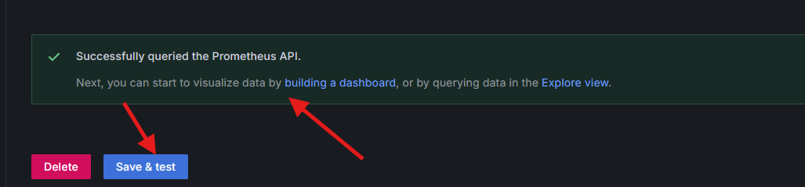

# Metrics - Service  

## Prometheus 

 Prometheus 

 Traefik provides metrics that are collected by a Prometheus server and visualized through Grafana dashboards. Follow this Link on PROD to Web-UI of Prometheus: 

<code> <a href="http://localhost/prometheus" target="_blank"> http://localhost/prometheus </a> </code>

    <figure>
        
        <figcaption>Prometheus entry by given path.</figcaption>
    </figure>

Here are some examples which metrics can be provided by Prometheus and can be shown on the Prometheus-Graphs.

    <figure>
        
        <figcaption>Collection of Traefik-Entrypoint Metrics</figcaption>
    </figure>

    <figure>
        
        <figcaption>Collection of Traefik-Entrypoint Metrics</figcaption>
    </figure>

## Grafana - Monitoring

 Grafana 

 For monitoring purposes, Traefik provides metrics that are collected by a Prometheus server and visualized through Grafana dashboards. Follow this Link on PROD to Web-UI of Grafana: 

<code> <a href="http://localhost/metrics-ui-service/login" target="_blank"> http://localhost/metrics-ui-service/login </a> </code>

<code> username: admin </code>

<code>  password: admin </code>

 We have for each of our services a monitoring dashboards. In the following section, we will have a closer look on those dashboards. 

<h3> Connect Prometheus with Grafana </h3>

 To enable Grafana to capture metrics from Prometheus, Prometheus first needs to be connected. To achieve this, we need to run all Docker containers in the PROD environment. 

 After executing this, you need to access <a href="localhost/dashboards/ " target="_blank">localhost/dashboards/ </a> to retrieve the IP address of the <strong<metrics-service@docker</strong> service. 

<figure>
    
    <figcaption>IP-Address of smetrics-service@docker </figcaption>
</figure>

 Now, we need to connect the data source in Grafana by creating a new Prometheus connection and linking it using the retrieved IP address. 

<figure>
    
    <figcaption>Using the IP-Address for the Prometheus Backend Connection </figcaption>
</figure>

<figure>
    
    <figcaption>Successful Connection </figcaption>
</figure>

 Now, we are able to create dashboards by using the provided metrics from the prometheus server. 

<figure>
    
    <figcaption>Add new Dashbaord </figcaption>
</figure>

<figure>
    
    <figcaption> Connect to the establish prometheus server </figcaption>
</figure>

<figure>
    
    <figcaption> Using services metrics from Prometheus Server </figcaption>
</figure>

### Login-Service

 Login-Service 

### Customer-Information-Service

 Customer-Information-Service 

### Depot-Service

 Depot-Service 

### Transaction-Service

 Transaction-Service 

### Support-Service

 Support-Service 

 This dashboard provides a clear visualization of key performance metrics related to the support service, 
using Prometheus as the data source. 
Each panel is designed to monitor a specific aspect of the service, helping ensure reliability and performance optimization. 

<h3> Panel 1: Successful Support Requests (Max Duration) </h3>

This gauge panel shows the maximum processing time for successful support requests (HTTP 200 status). It helps in understanding the performance of the support service, particularly in measuring the longest request times. If the max duration consistently exceeds a certain threshold, this could indicate a performance bottleneck.

<figure>
    
    <figcaption>Screenshot of the max duration for successful support requests</figcaption>
</figure>

<h3> Panel 2: Sum of Support Requests Over Time (Timeseries) </h3>

This timeseries panel visualizes the total number of support requests handled by the service over time. Monitoring this data helps detect spikes in request volume, which could indicate periods of high load or unusual activity that might need investigation.

<figure>
    
    <figcaption>Screenshot of the sum of support requests over time</figcaption>
</figure>

<h3> Panel 3: Max Request Time for Status 200 (Timeseries) </h3>

This timeseries panel tracks the maximum duration of HTTP 200 status requests over time. By monitoring this metric, you can identify trends in performance for successful requests and potentially spot periods of degraded performance before they escalate into more significant issues.

<figure>
    
    <figcaption>Screenshot of the max request time for HTTP 200 status requests</figcaption>
</figure>

<h3> Panel 4: Max Request Time for Status 200 </h3>

This panel measures the maximum request time for HTTP 200 status requests. It provides immediate insight into how quickly requests are being processed and can alert the team to performance issues that may require tuning or scaling.

<figure>
    
    <figcaption>Screenshot of the max request time for HTTP 200 status requests</figcaption>
</figure>

<h3> Panel 5: Duration of Server Connections in Seconds </h3>

This gauge panel tracks the duration of server connections in seconds. It is useful for identifying potential issues with connection handling in the support service, particularly if connection times begin to increase unexpectedly, potentially leading to timeouts or degraded service quality.

<figure>
    
    <figcaption>Screenshot of the duration of server connections</figcaption>
</figure>

<h3> Conclusion </h3>
This dashboard offers essential metrics to monitor the performance and reliability of the support service. By keeping track of request times, connection durations, and overall service load, you can ensure that the support service remains responsive and scalable, identifying and addressing potential bottlenecks or performance degradations in a timely manner.

