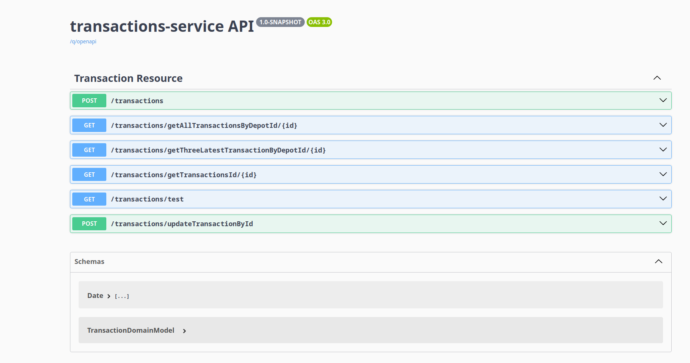
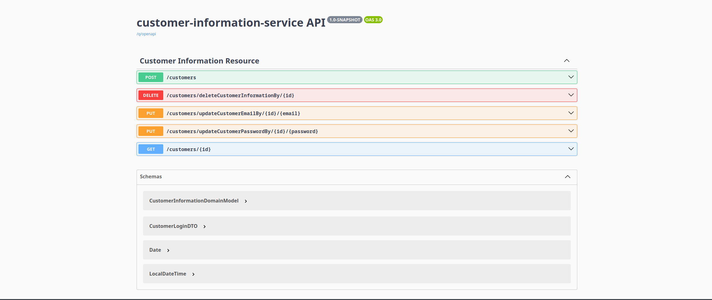

# How to start and use the system

## How to run

To start the system run the run.sh file on:

- windows: ./run.sh
- linux: sh ./run.sh

<figure>
    
    <figcaption>First Question of the run.sh</figcaption>
</figure>

<figure>
    
    <figcaption>Second Question of the run.sh</figcaption>
</figure>

After the Docker-Compose runs you can move on to step 1.

## 1. Traefik API Gateway

Take a look at the Traefik dashboard.

> **Path:** [http://localhost/dashboard/](http://localhost/dashboard/)

Traefik acts as API gateway and load balancer.
It's configured in the _docker-compose-prod.yml_ and picks up running containers automatically.
Thus, it will recognize containers that are started or stopped while the system is already running.

<figure>
    
    <figcaption>Traefik Dashboard</figcaption>
</figure>

## 2. Endpoints with Swagger-UI

### Swagger UI with Traefik in Dev Mode

Traefik is a powerful reverse proxy and load balancer that can automatically discover and manage services. 
In development mode, Traefik comes with built-in support for Swagger UI, a popular tool for visualizing and interacting with APIs.
Once Traefik is running in dev-mode, you can access the Swagger UI by navigating to the following URL in your web browser:

> **Path:**  http://localhost:8080/q/dev-ui/io.quarkus.quarkus-smallrye-openapi/swagger-ui

In the following you can see all the endpoints of our services:

<figure>
    
    <figcaption>Endpoints of Login-Service</figcaption>
</figure>

<figure>
    
    <figcaption>Endpoints of Depot-Service</figcaption>
</figure>

<figure>
    
    <figcaption>Endpoints of Transaction-Service</figcaption>
</figure>

<figure>
    
    <figcaption>Endpoints of Customer-Information-Service</figcaption>
</figure>

<figure>
    
    <figcaption>Endpoints of Support-Service</figcaption>
</figure>

### 2. Jaeger UI / Tracing

If started with the **_-t_** flag, have a look at the Jaeger UI.

> **Path:** [http://localhost/tracing](http://localhost/tracing)

Jaeger is our OpenTelemetry compliant service that collects tracing information from all services comprising our system.
With that data, one is able to examine how requests _move_ through the system, gather insights about processing times as
well as errors that happen along the way.

<figure>
    
    <figcaption>Jaeger main screen showing captured traces</figcaption>
</figure>

<figure>
    
    <figcaption>Jaeger showing a trace graph, e.g. the dependencies between different spans</figcaption>
</figure>

<figure>
    
    <figcaption>Jaeger showing detail of a trace & its spans</figcaption>
</figure>

### 3. Prometheus / Metrics

If started with the **_-m_** flag, have a look at Prometheus, the system that aggregates metric data from all services (
e.g. our own Quarkus services, databases, Traefik and, yes, Prometheus itself).

> **Path:** [http://localhost/prometheus](http://localhost/prometheus)

    <figure>
        
        <figcaption>Prometheus showing bytes used by the JVM</figcaption>
    </figure>

### 4. Grafana / Metrics Dashboards

If started with the **_-mui_** flag, Grafana is available.

> **Path:** [http://localhost/metrics-ui-service](http://localhost/metrics-ui-service)

Upon first access, login with *admin:admin*, you are then asked to provide a new password.

Grafana needs to connect to a *data source*; this will be Prometheus in our case. Select the appropriate option at the
main page and enter `http://metrics-service:9090/metrics-service` under *Connection*. Afterward, you are able to build
dashboards showing the data imported from Prometheus. This can be really time-consuming; luckily, on can import
pre-configured dashboards. Some useful ones are the following:

-
Quarkus: [https://grafana.com/grafana/dashboards/14370-jvm-quarkus-micrometer-metrics/](https://grafana.com/grafana/dashboards/14370-jvm-quarkus-micrometer-metrics/)
- Traefik: [https://grafana.com/grafana/dashboards/4475-traefik/](https://grafana.com/grafana/dashboards/4475-traefik/)
-
Jaeger: [https://grafana.com/grafana/dashboards/12535-jaeger-all-in-one/](https://grafana.com/grafana/dashboards/12535-jaeger-all-in-one/)
-
Prometheus: [https://grafana.com/grafana/dashboards/3662-prometheus-2-0-overview/](https://grafana.com/grafana/dashboards/3662-prometheus-2-0-overview/)
-
cAdvisor: [https://grafana.com/grafana/dashboards/11600-docker-container/](https://grafana.com/grafana/dashboards/11600-docker-container/)

Beside metric data from Prometheus, Grafana can also connect to your databases to create dashboards that show the nature
of your data.

<figure>
    
    <figcaption>Grafana Metrics Explorer</figcaption>
</figure>

<figure>
    
    <figcaption>Grafana Quarkus Dashboard</figcaption>
</figure>

<figure>
    
    <figcaption>Grafana Jaeger Dashboard</figcaption>
</figure>

## References

- Quarkus & Gradle: [https://quarkus.io/guides/gradle-tooling](https://quarkus.io/guides/gradle-tooling)
- Quarkus Path
  Resolution: [https://quarkus.io/blog/path-resolution-in-quarkus/](https://quarkus.io/blog/path-resolution-in-quarkus/)
- GitLab CI/CD
  Variables: [https://docs.gitlab.com/ee/ci/variables/predefined_variables.html](https://docs.gitlab.com/ee/ci/variables/predefined_variables.html)
- Build Docker in Docker in GitLab
  CI/CD: [https://docs.gitlab.com/ee/ci/docker/using_docker_build.html](https://docs.gitlab.com/ee/ci/docker/using_docker_build.html)
- TestContainers in GitLab
  CI/CD: [https://www.atomicjar.com/2023/01/running-testcontainers-tests-on-gitlab-ci/](https://www.atomicjar.com/2023/01/running-testcontainers-tests-on-gitlab-ci/)
- Traefik Examples: [https://github.com/frigi83/traefik-examples](https://github.com/frigi83/traefik-examples)
- GitLab CI/CD
  Intro: [https://about.gitlab.com/blog/2020/12/10/basics-of-gitlab-ci-updated/](https://about.gitlab.com/blog/2020/12/10/basics-of-gitlab-ci-updated/)
- GitLab CI/CD Gradle Build
  Cache: [https://blog.jdriven.com/2021/11/reuse-gradle-build-cache-on-gitlab/](https://blog.jdriven.com/2021/11/reuse-gradle-build-cache-on-gitlab/)
