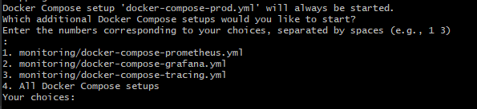

# How to start and use the system

## Run Backend on PROD

Run Backend on PROD 

<ul>
  <li>Start in the root directory of this project.</li>
  <li>Run this shell script:
    <ul>
      <li>Linux/Mac: 
        <pre><code>sh run.sh</code></pre>
      </li>
      <li>Windows: 
        <pre><code>./run.sh</code></pre>
      </li>
    </ul>
  </li>
  <li>Press `y/yes` to build the entire project:</li>
</ul>

<figure>
    
</figure>

<ul>
  <li>After the build finishes, press `5` to run all docker-compose files:</li>
</ul>

<figure>
    
</figure>

<ul>
  <li>Now we can see the services running:</li>
</ul>

<figure>
    
</figure>

<ul>
  <li>Go to the browser: <a href="http://localhost/dashboard/" target="_blank">http://localhost/dashboard/</a></li>
</ul>

<ul>
  <li>Insert these credentials:
    <ul>
      <pre><code>user</code></pre>
      <pre><code>123</code></pre>
    </ul>
  </li>
  <li>Here is the dashboard on PROD:</li>
</ul>

<figure>
    
</figure>

<ul>
  <li>To initialize the database with data needed in the app, run:
    <ul>
      <li>Linux/Mac: 
        <pre><code>sh project-script.sh</code></pre>
      </li>
      <li>Windows: 
        <pre><code>./project-script.sh</code></pre>
      </li>
    </ul>
  </li>
</ul>

(<a href="#top">back to top</a>)

## DEV-UI

 DEV-UI 

<ul>
  <li><pre><code>http://localhost:8080/q/dev-ui/io.quarkus.quarkus-smallrye-openapi/swagger-ui</code></pre></li>
  <li><pre><code>http://localhost:8080/q/dev-ui/io.quarkus.quarkus-kafka-client/topics</code></pre></li>
  <li><pre><code>http://localhost:8080/dashboard/#/</code></pre></li>
</ul>

(<a href="#top">back to top</a>)

## Quarkus-UI in PROD

 Quarkus-UI in PROD 

<ul>
  <li><pre><code>http://localhost/dashboard/#/</code></pre></li>
</ul>

(<a href="#top">back to top</a>)

## Prometheus & Grafana in PROD

 Prometheus & Grafana in PROD 

<ul>
  <li>Traefik-Dashboard: <pre><code>http://localhost/dashboard/</code></pre></li>
  <li>Prometheus: <pre><code>http://localhost/prometheus</code></pre></li>
  <li>Grafana: <pre><code>http://localhost/metrics-ui-service/login</code></pre></li>
  <li>Jaeger-Tracing: <pre><code>http://localhost/tracing/search</code></pre></li>
</ul>

(<a href="#top">back to top</a>)

