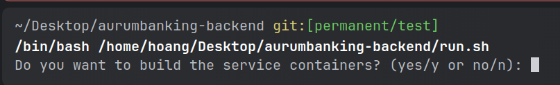

# How to start and use the system 

## How to run stuff

## Run mdkocs locally
1. run on on root path of this project:
- linux, mac: `sh assemble-docs.sh`
  - windows: `./assemble-docs.sh`
2. `python -m pip install mkdocs`
3. `python -m pip install mkdocs-material`
4. `python -m mkdocs serve --dev-addr 127.0.0.1:4242`

## Run Backend on PROD

- start in the root dir of this project
- run this shell scrip:
    - linix/mac: `sh run.sh`
    - windows: `./run.sh`
- press y/yes to build the entire project:

- after build finish, press number 5 to run all docker-compose files:

- now we can see the services running

- go to browser: `http://localhost/dashboard/`

- insert this credetials:
    - `user`
    - `123`

- Here is the dashboard on prod:

- to initialize the database with data which will be needed in the app, run:
    - linix/mac: `sh rproject-script.sh`
    - windows: `./project-script.sh`

## DEV-UI

- `http://localhost:8080/q/dev-ui/io.quarkus.quarkus-smallrye-openapi/swagger-ui`
- `http://localhost:8080/q/dev-ui/io.quarkus.quarkus-kafka-client/topics`
- `http://localhost:8080/dashboard/#/`

## Quarkus-UI in PROD

- http://localhost/dashboard/#/

Prometheus & Grafana in PROD

- Traefk-Dashboard: http://localhost/dashboard/
- Prometheus: http://localhost/prometheus
- Grafana: http://localhost/metrics-ui-service/login
- Jaeger-Tracing: http://localhost/tracing/search

