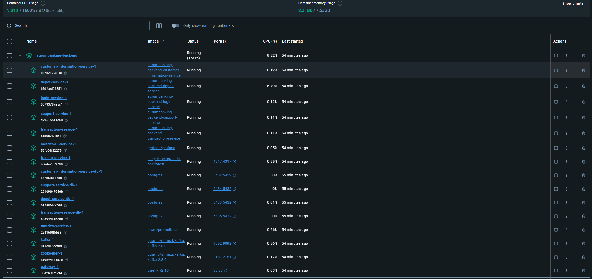
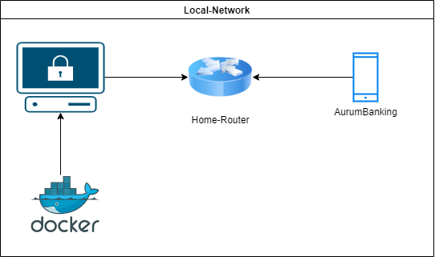
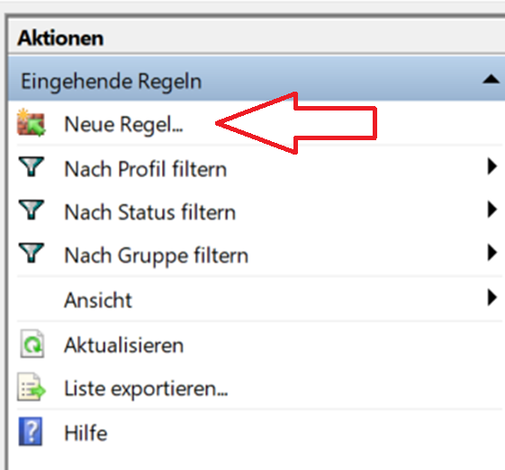

# How to start and use the system

## Run Backend on PROD

Run Backend on PROD 

<ul>
  <li>Start in the root directory of this project.</li>
  <li>Run this shell script:
    <ul>
      <li>Linux/Mac: 
        <pre><code>sh run.sh</code></pre>
      </li>
      <li>Windows: 
        <pre><code>./run.sh</code></pre>
      </li>
    </ul>
  </li>
  <li>Press `y/yes` to build the entire project:</li>
</ul>

<figure>
    
</figure>

<ul>
  <li>After the build finishes, press `5` to run all docker-compose files:</li>
</ul>

<figure>
    
</figure>

<ul>
  <li>Now we can see the services running:</li>
</ul>

<figure>
    
</figure>

<ul>
  <li>Go to the browser: <a href="http://localhost/dashboard/" target="_blank">http://localhost/dashboard/</a></li>
</ul>

<ul>
  <li>Insert these credentials:
    <ul>
      <pre><code>user</code></pre>
      <pre><code>123</code></pre>
    </ul>
  </li>
  <li>Here is the dashboard on PROD:</li>
</ul>

<figure>
    
</figure>

<ul>
  <li>To initialize the database with data needed in the app, run:
    <ul>
      <li>Linux/Mac: 
        <pre><code>sh project-script.sh</code></pre>
      </li>
      <li>Windows: 
        <pre><code>./project-script.sh</code></pre>
      </li>
    </ul>
  </li>
</ul>

(<a href="#top">back to top</a>)

## Connection-Backend-App

Connection-Backend-App

<h3> Local Network-Design </h3>

To get the project running, you will need two devices:

<ul>
    <li>A computer where the backend runs.</li>
    <li>A computer or smartphone where the app runs.</li>
</ul>

 
The app connects to the backend via our Wi-Fi router using the IPv4 address assigned by the router to the server PC running the backend. 
The backend operates within a Docker container on the host server computer. 
This is further illustrated in the diagram below: 

<figure>
    
    <figcaption>Local Network-Design to connect the App with the Backend </figcaption>
</figure>

<h3> Establish App and Backend Connection </h3>

<ol>
    <li>Run the Backend on PROD, use the previous instructions.</li>
    <li>After this, we need to enable port 80 on our host pc, where the backend runs :
    <ul>
      <li>Linux: 
        <pre><code> sudo ufw allow 80/tcp</code></pre> 
        or
        <pre><code> sudo firewall-cmd --permanent --add-port=80/tcp </code></pre> 
        <pre><code> sudo firewall-cmd --reload </code></pre> 
      </li>
      <li>Windows: 
       <figure>
            
            <figcaption> Use <code>Win + R</code> to open this windows </figcaption>
        </figure>
         <figure>
            
            <figcaption> Click on <code>Eingehende Regel</code> and click on the left tab <code>Neue Regel</code></figcaption>
        </figure>
         <figure>
            
            <figcaption> Follow the Port-Assistent </figcaption>
        </figure>
         <figure>
            
            <figcaption> Now you can find your new rule and the port is available </figcaption>
        </figure>
      </li>
    </ul>
  </li>
  <li>Now look for the IP-Address of the WLAN or LAN Adapter of your pc and remember it.:</li>
    <ul>
        <li>Linux: 
            <pre><code> ifconfig </code></pre>
        </li>
        <li>Windows: 
            <pre><code> ipconfig </code></pre>
        </li>
   </ul>
   <li>Now we take the IP-Address from the instruction before and insert into our App-Files:</li>
    <ul>
        <figure>
            
            <figcaption> Enable Internet Connection in the File <code>app/src/main/AndroidManifest.xml</code> </figcaption>
        </figure>
        <figure>
            
            <figcaption> Insert the IP-Address in <code>res/xml/network_security_config.xml</code> </figcaption>
        </figure>
        <figure>
            
            <figcaption> Insert the IP-Address in <code>app/src/main/java/de/fhe/ai/mc/app/di/Modules.kt</code></figcaption>
        </figure>
   </ul>
    <li>Now go into the root folder of the Backend-Project and run (linux terminal required):
    <ul>
        <pre><code> sh project-script.sh </code></pre>
        
 This will create http-request and fill the database with data. So you can login the app and use the functionality of the app. 

    </ul>
</ol>

(<a href="#top">back to top</a>)

## DEV-UI

 DEV-UI 

<ul>
  <li><pre><code>http://localhost:8080/q/dev-ui/io.quarkus.quarkus-smallrye-openapi/swagger-ui</code></pre></li>
  <li><pre><code>http://localhost:8080/q/dev-ui/io.quarkus.quarkus-kafka-client/topics</code></pre></li>
  <li><pre><code>http://localhost:8080/dashboard/#/</code></pre></li>
</ul>

(<a href="#top">back to top</a>)

## Quarkus-UI in PROD

 Quarkus-UI in PROD 

<ul>
  <li><pre><code>http://localhost/dashboard/#/</code></pre></li>
</ul>

(<a href="#top">back to top</a>)

## Prometheus & Grafana in PROD

 Prometheus & Grafana in PROD 

<ul>
  <li>Traefik-Dashboard: <pre><code>http://localhost/dashboard/</code></pre></li>
  <li>Prometheus: <pre><code>http://localhost/prometheus</code></pre></li>
  <li>Grafana: <pre><code>http://localhost/metrics-ui-service/login</code></pre></li>
  <li>Jaeger-Tracing: <pre><code>http://localhost/tracing/search</code></pre></li>
</ul>

(<a href="#top">back to top</a>)

