# Architecture Design Overview

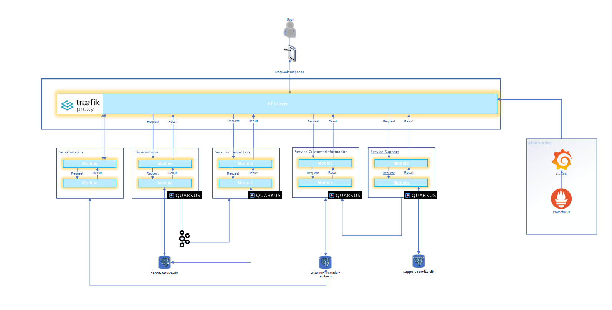

Our architecture design follows a microservices approach, with Traefik and Zookeeper serving as load balancers. The system comprises the following microservices:

- **login-service**
- **customer-information-service**
- **depot-service**
- **transaction-service**
- **support-service**

All services are developed using Kotlin (JDK 17) and Quarkus.

## Kafka Integration

The `depot-service` and `transaction-service` share a Kafka topic named `update-depot-value`. When a new transaction is initiated, it is published to the `update-depot-value` Kafka topic and subsequently consumed by the `depot-service`.

## Database Management

PostgreSQL is used as the database management system. Specifically:
- The `login-service` and `customer-information-service` access the `customer-information-service-db`.
- The `depot-service` and `transaction-service` use the `depot-service-db`.
- The `support-service` utilizes the `support-service-db`.

Here are the database-model of our databases:

<figure>
    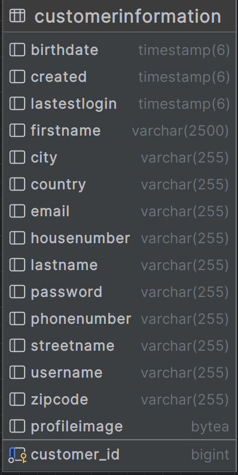
    <figcaption>Customer-Information-Database Entity</figcaption>
</figure>

<figure>
    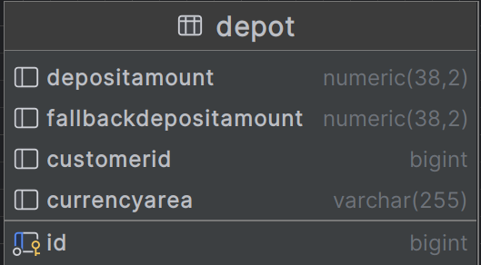
    <figcaption>Depot-Database Entity</figcaption>
</figure>

<figure>
    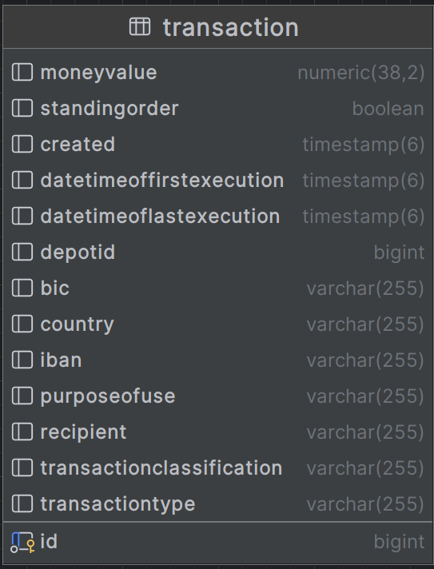
    <figcaption>Transaction-Database Entity</figcaption>
</figure>

<figure>
    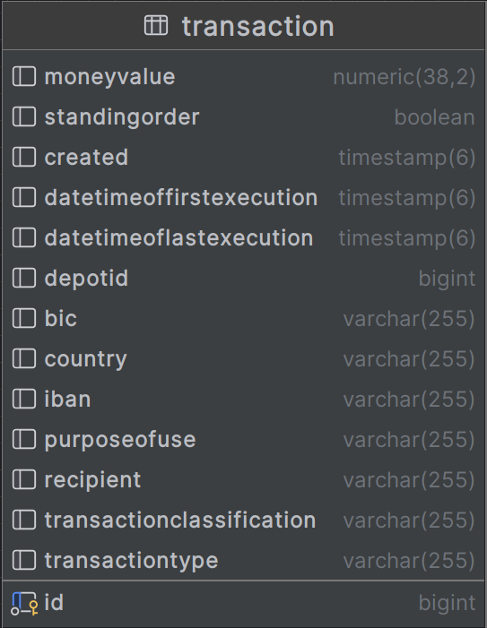
    <figcaption>Support-Database Entity</figcaption>
</figure>

## Monitoring

For monitoring purposes, Traefik provides metrics that are collected by a Prometheus server and visualized through Grafana dashboards.

## Traefik API Gateway

Take a look at the Traefik dashboard on the Prod-Enviroment.

> **Path:** [http://localhost/dashboard/](http://localhost/dashboard/)

Traefik acts as API gateway and load balancer.
It's configured in the _docker-compose-prod.yml_ and picks up running containers automatically.
Thus, it will recognize containers that are started or stopped while the system is already running.

<figure>
    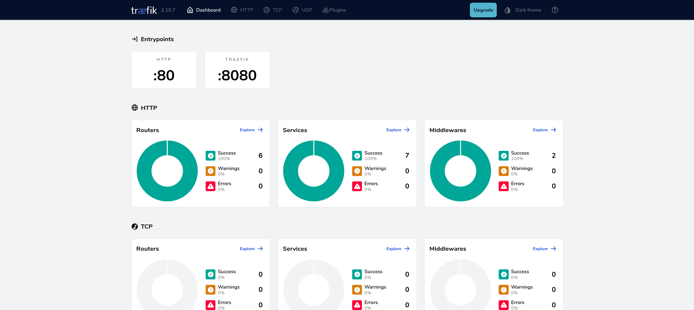
    <figcaption>Traefik Dashboard</figcaption>
</figure>

## Endpoints with Swagger-UI

### Swagger UI with Traefik in Dev Mode

Traefik is a powerful reverse proxy and load balancer that can automatically discover and manage services.
In development mode, Traefik comes with built-in support for Swagger UI, a popular tool for visualizing and interacting with APIs.
Once Traefik is running in dev-mode, you can access the Swagger UI by navigating to the following URL in your web browser:

> **Path:**  http://localhost:8080/q/dev-ui/io.quarkus.quarkus-smallrye-openapi/swagger-ui

In the following you can see all the endpoints of our services:

<figure>
    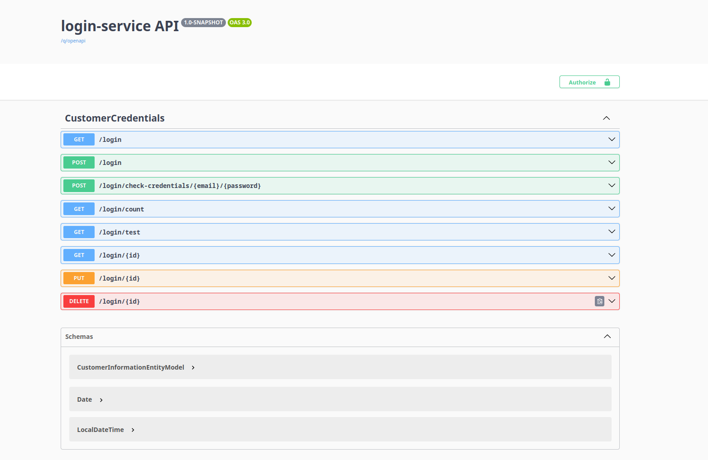
    <figcaption>Endpoints of Login-Service</figcaption>
</figure>

<figure>
    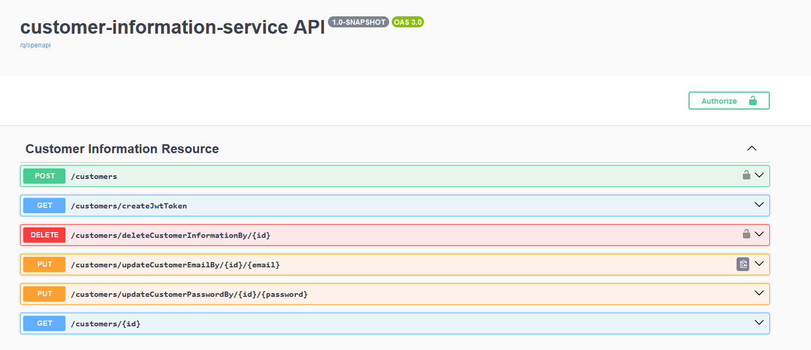
    <figcaption>Endpoints of Customer-Information-Service</figcaption>
</figure>

<figure>
    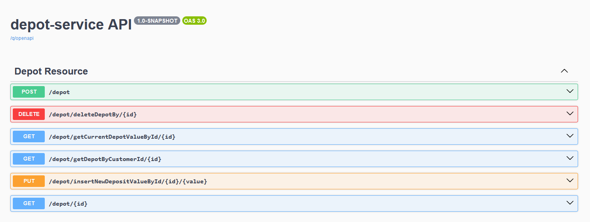
    <figcaption>Endpoints of Depot-Service</figcaption>
</figure>

<figure>
    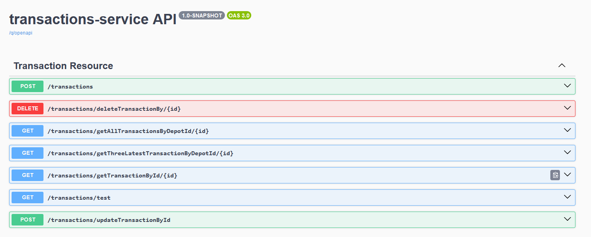
    <figcaption>Endpoints of Transaction-Service</figcaption>
</figure>

<figure>
    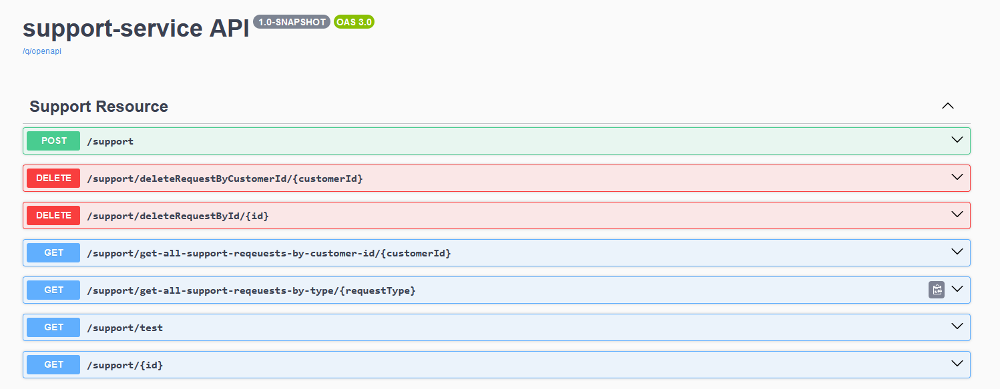
    <figcaption>Endpoints of Support-Service</figcaption>
</figure>

