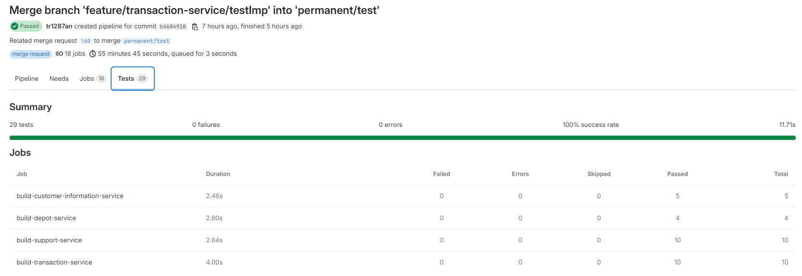

## Unit Testing in the Project

In our project, we place a strong emphasis on ensuring the reliability and stability of our services through comprehensive unit testing. Our testing strategy is incorporated directly into the CI/CD pipeline, which ensures that our services are consistently tested before any changes are integrated.

### Unit Tests for Services

We have implemented a robust set of unit tests that target various layers of our services. These tests focus on the following areas:

- **Endpoint Testing (Resource Tests):**  
  Resource tests are specifically focused on testing the external endpoints of our services. These tests simulate real-world API calls to ensure that the endpoints are functioning correctly, returning the expected responses, and handling error scenarios appropriately. This ensures that our services provide the correct output and behavior when interacting with external clients.

- **Repository Testing (Repository Tests):**  
  Our repository tests are responsible for testing the interaction with the database. These tests validate that the data layer behaves correctly, ensuring that our database queries and transactions are executed as expected. This helps in verifying that the data is being correctly retrieved, stored, and manipulated by the application.

### CI/CD Pipeline Integration

Our CI/CD pipeline is configured to automatically run all unit tests whenever a change is pushed to the repository. This integration ensures that:

1. **Test Results in Pipeline:**  
   The pipeline captures the results of all unit tests, including the service, resource, and repository tests. Any failure in these tests prevents the build from proceeding, ensuring that only thoroughly tested code is deployed.

2. **UI Monkey Tests:**  
   In addition to the unit tests, we perform UI monkey testing, which randomly interacts with the user interface to catch unexpected crashes or issues. This test simulates a wide range of user interactions to ensure the robustness of our UI. These UI tests are also integrated into our pipeline, providing a broader validation of the system's stability.

### Pipeline Test Results

<figure>
    
    <figcaption>Screenshot of pipeline</figcaption>
</figure>

The pipeline logs and reports provide detailed information about the status and results of each test, helping us to maintain a reliable and stable codebase throughout the development lifecycle.

For more details, check the code implementation in the respective service within the **test** directory.